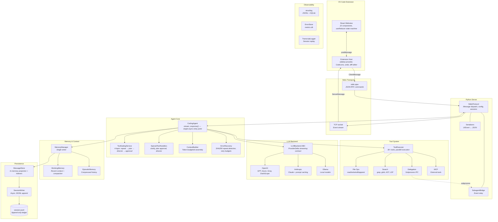
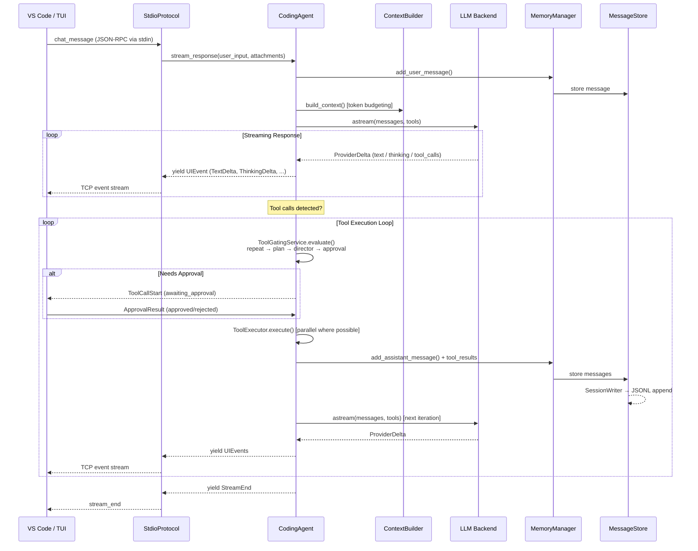
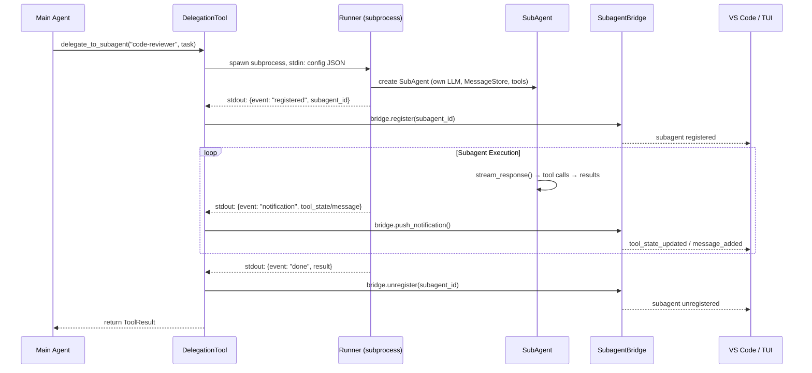

# ClarAIty Code

An AI-powered coding agent with a Textual TUI, VS Code extension, 30+ built-in tools, subagent delegation, and multi-LLM support. Built entirely from scratch in Python + TypeScript -- no LangChain, no AutoGen, no frameworks.

**~86K lines of Python | ~6K lines of TypeScript/React | 227 source files | 20 modules**

---

## Architecture



### Key Design Decisions

- **Streaming-first**: LLM responses stream through every layer to the UI. Nothing is buffered end-to-end.
- **Single writer persistence**: Only `MemoryManager` writes to `MessageStore`. The TUI and VS Code read via subscriptions.
- **Protocol-agnostic core**: The agent yields `UIEvent` objects and accepts `UserAction` inputs through an abstract protocol. It knows nothing about transport.
- **4-layer tool gating**: Repeat detection (SHA256) -> Plan mode gate -> Director gate -> Human approval. Composable, not monolithic.
- **Budget-aware context**: Token counting at every stage with GREEN/YELLOW/ORANGE/RED pressure thresholds that trigger compaction.
- **Subagent isolation**: Each subagent runs in its own subprocess with independent context, LLM config, and message store.

---

## Module Map

```
src/
├── core/               # Agent orchestrator, tool gating, streaming, error recovery
├── llm/                # LLM backends (OpenAI, Anthropic, Ollama), retry, credentials
├── tools/              # 30+ tools: file ops, search, git, web, delegation, planning
├── memory/             # Working memory, episodic memory, compaction, context injection
├── session/            # Message store, JSONL persistence, session resume
├── ui/                 # Textual TUI (3300-line app), widgets, store adapter
├── server/             # Stdio + WebSocket servers, JSON-RPC, event serialization
├── subagents/          # Subprocess-based specialist agents with IPC
├── director/           # Multi-phase task orchestration
├── prompts/            # System prompts, enrichment, templates
├── observability/      # Structured JSONL logging, SQLite metrics, transcript logger
├── code_intelligence/  # LSP client, AST analysis, symbol resolution
├── integrations/       # Jira, MCP (Model Context Protocol)
├── hooks/              # Lifecycle hooks (pre/post tool execution)
├── security/           # File permission validation, path sandboxing
├── platform/           # Windows-specific adaptations
└── claraity/           # Knowledge DB + Beads task tracker (2 SQLite DBs)

claraity-vscode/        # VS Code extension
├── src/                # Extension host (TS): sidebar provider, stdio transport, CodeLens
└── webview-ui/         # React webview: 22 components, central reducer state machine
```

---

## Core Data Flow

### User Message to Agent Response



### Subagent Lifecycle



---

## Tools (30+)

| Category | Tools |
|----------|-------|
| **File Operations** | `read_file`, `write_file`, `edit_file`, `append_to_file`, `list_directory` |
| **Code Search** | `search_code`, `grep`, `glob`, `analyze_code`, `get_file_outline`, `get_symbol_context` |
| **Git** | `git_status`, `git_diff` |
| **Web** | `web_search`, `web_fetch` |
| **Execution** | `run_command` (with command safety analysis) |
| **Planning** | `enter_plan_mode`, `request_plan_approval` |
| **Delegation** | `delegate_to_subagent` (8 specialist types) |
| **Knowledge** | `knowledge_query`, `knowledge_update` |
| **Other** | `create_checkpoint`, `clarify` |

---

## Subagents

Specialist agents that run as isolated subprocesses, each with their own context window and configurable LLM:

| Agent | Purpose |
|-------|---------|
| **code-reviewer** | Code quality, security, performance analysis |
| **test-writer** | Comprehensive test suite generation |
| **doc-writer** | Technical documentation |
| **code-writer** | Focused implementation (no exploration) |
| **explore** | Read-only codebase navigation |
| **planner** | Step-by-step implementation plans |
| **general-purpose** | Full tool access for multi-step tasks |
| **knowledge-builder** | Autonomous knowledge base generation |

---

## LLM Support

Works with any OpenAI-compatible API. Three native backends:

| Backend | Providers |
|---------|-----------|
| **OpenAI** | GPT-4o, GPT-4.1, o3, Azure OpenAI, Groq, DashScope, Together.ai |
| **Anthropic** | Claude Sonnet, Opus, Haiku -- with native prompt caching |
| **Ollama** | Any local model (Qwen, DeepSeek, Llama, Mistral, etc.) |

Features: automatic prompt caching (50-80% cost reduction on long sessions), exponential backoff with jitter, credential store (OS keyring + env fallback), hot-swap model config without restart.

---

## VS Code Extension

Full-featured sidebar with:

- **Chat interface** with streaming markdown, syntax highlighting, image paste
- **Tool cards** with live status, approve/reject buttons, inline diff viewer
- **Subagent cards** with nested tool execution visibility
- **Interactive widgets**: clarify questions, plan approval, pause prompts
- **CodeLens**: Accept/Reject/View Diff on agent-modified files
- **File decorations**: "AI" badge on modified files
- **Undo manager**: Per-turn file snapshot checkpoints (max 10)
- **Config panel**: LLM backend, model, temperature, subagent overrides
- **Session management**: List, resume, and replay past sessions

Transport: stdin (JSON-RPC commands) + TCP socket (event stream). TCP used instead of stdout due to a Windows libuv pipe reliability issue.

---

## Observability

- **Structured logging**: `structlog` -> async queue -> JSONL file + SQLite (no console output)
- **Metrics DB**: `.claraity/metrics.db` -- error taxonomy, performance tracking
- **Transcript logger**: Full conversation replay with head/tail preservation
- **Context propagation**: `ContextVar`-based run_id, session_id, stream_id across async boundaries
- **Automatic redaction**: API keys, tokens, database URIs stripped from logs

```bash
python -m src.observability.log_query --tail 50
```

---

## Permission Modes

| Mode | Behavior | Toggle |
|------|----------|--------|
| **Normal** | Asks approval for write/execute operations | `/mode n` or `Alt+M` |
| **Auto** | Executes all tools without asking | `/mode a` |
| **Plan** | Read-only -- write operations blocked entirely | `/mode p` |

---

## Setup

### From Source

```bash
git clone <repo-url>
cd ai-coding-agent
pip install -e ".[dev]"
```

Requires **Python 3.10+**.

### LLM Configuration

Set via environment variables or `.claraity/config.yaml`:

```bash
export LLM_API_KEY=your-key
export LLM_BASE_URL=https://api.openai.com/v1
export LLM_MODEL=gpt-4o
```

Or for local models:

```bash
ollama pull qwen2.5-coder:7b
export LLM_BACKEND_TYPE=ollama
export LLM_MODEL=qwen2.5-coder:7b
```

### Run

```bash
python -m src.cli
```

### VS Code Extension

```bash
cd claraity-vscode
npm install && npm run build
# Install the .vsix from claraity-vscode/ directory
```

---

## Configuration

All configuration in `.claraity/config.yaml`:

```yaml
llm:
  backend_type: openai
  base_url: https://api.openai.com/v1
  model: gpt-4o
  context_window: 128000
  temperature: 0.2
  max_tokens: 16384

  subagents:
    code-reviewer:
      model: claude-sonnet-4-5-20250929
    test-writer:
      model: claude-sonnet-4-5-20250929

mcp_servers:
  - name: jira
    server_url: http://localhost:3000/sse
    tool_prefix: jira_
```

---

## Project Structure

```
.claraity/                  # Project-level config and data
  config.yaml               # LLM, logging, MCP configuration
  sessions/                 # JSONL session files
    subagents/              # Subagent transcripts
  logs/app.jsonl            # Structured application logs
  metrics.db                # SQLite metrics and error tracking
  knowledge/                # Project knowledge files (loaded at startup)
  memory.md                 # Project-level memory (team-shareable)
```

---

## Testing

```bash
pytest tests/                                    # All tests
pytest tests/tools/test_file_operations.py -v    # Specific file
pytest -m "not integration"                      # Skip integration tests
```

---

## License

MIT License. See [LICENSE](LICENSE) for details.
