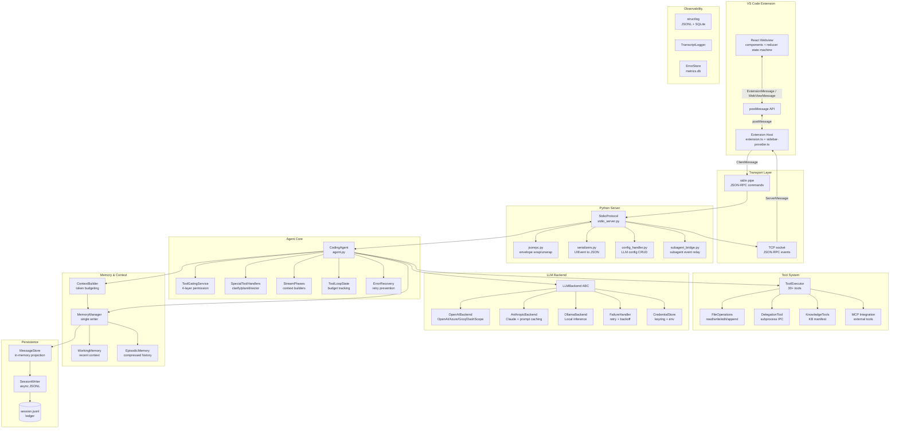
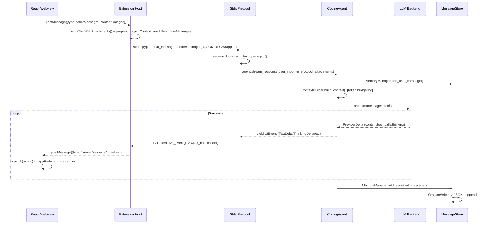
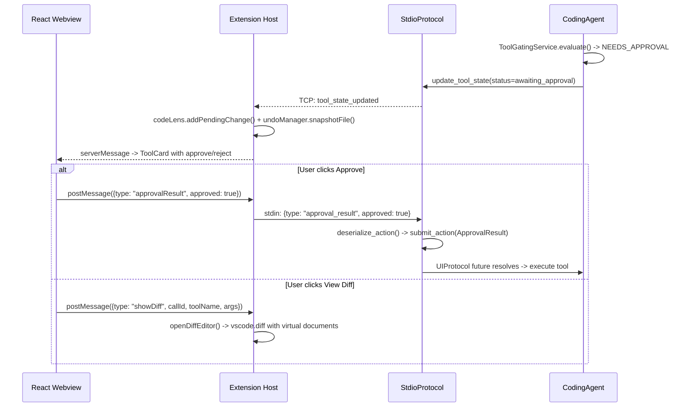
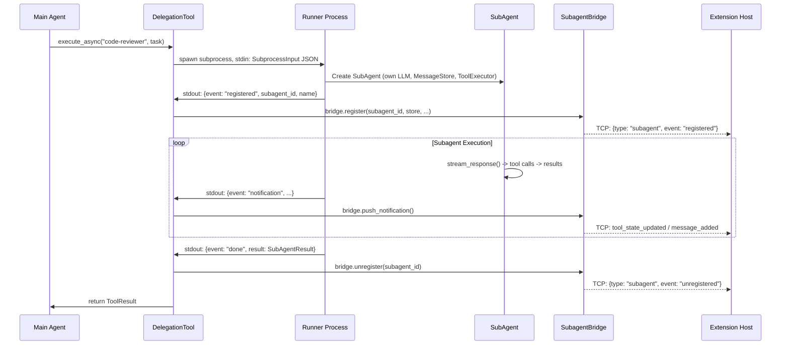
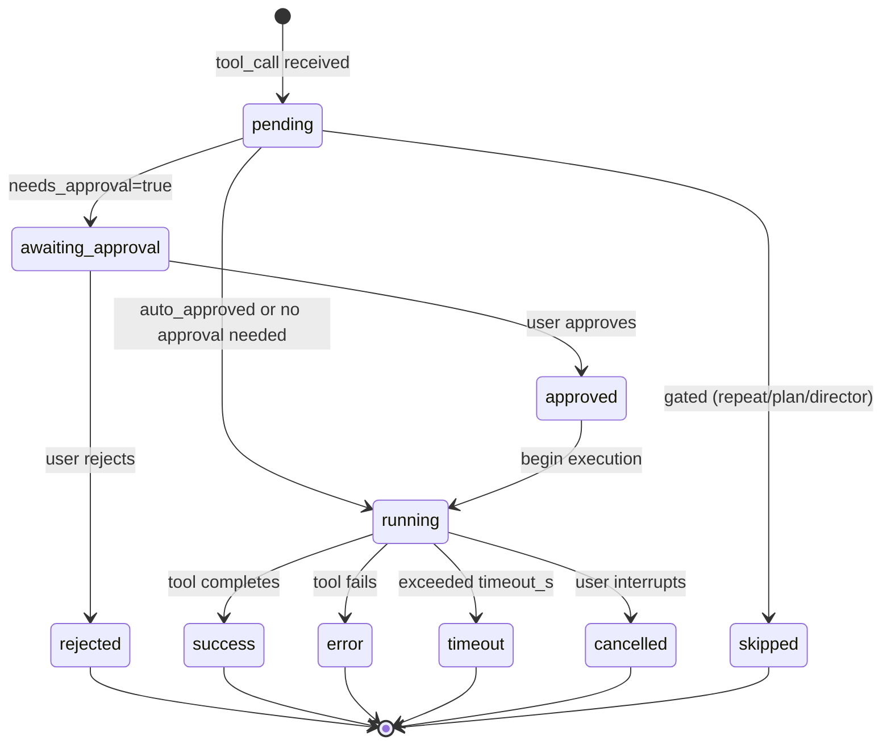
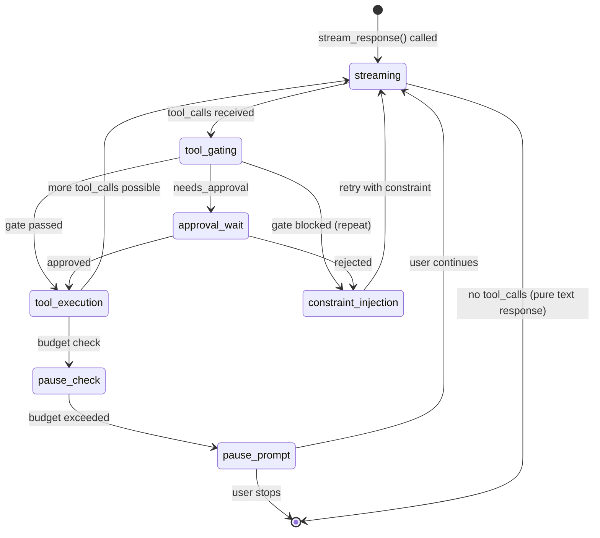

# ClarAIty Architecture Deep Dive

> **Purpose**: Complete architectural trace of ClarAIty from VS Code Extension (React) through every layer to persistence. Optimized for LLM consumption and usable as a training guide for building a cutting-edge coding agent.
>
> **Scope**: VS Code React webview -> Extension Host -> stdio transport -> Python server -> Agent core -> LLM -> Tools -> Memory -> Persistence -> Observability

---

## 1. System Topology



---

## 2. Layer-by-Layer Architecture Trace

### 2.1 React Webview (claraity-vscode/webview-ui/)

**Entry**: `main.tsx` -> `App.tsx` -> central `useReducer(appReducer, initialState)`

**State Machine**: `state/reducer.ts` -- single source of truth for all UI state. The reducer logic is split across `state.ts`, `actions.ts`, and `dispatch.ts` for maintainability.

```
AppState {
  // Connection
  connected, sessionId, modelName, permissionMode, workingDirectory
  // Chat
  messages[], isStreaming, markdownBuffer
  // Timeline (flat ordered array -- core rendering abstraction)
  timeline: TimelineEntry[]  // user_message | assistant_text | tool | thinking | code | subagent | error
  // Tool Cards
  toolCards: Record<callId, ToolStateData>
  toolOrder: string[]  // insertion order
  toolCardOwners: Record<callId, subagentId>  // subagent ownership
  // Interactive Widgets
  pendingApproval, pausePrompt, clarifyRequest, planApproval
  // Subagents
  subagents: Record<id, SubagentInfo>
  promotedApprovals: Record<callId, ToolStateData>  // elevated to conversation level
  // Context
  contextUsed, contextLimit, sessionTotalTokens, sessionTurnCount
  // Panels
  activePanel: "chat" | "config" | "jira" | "sessions"
}
```

**Timeline Pattern**: Text accumulates in `markdownBuffer`. Before any non-text entry (tool card, thinking block, code block, subagent), `commitMarkdownBuffer()` flushes accumulated text into a `assistant_text` timeline entry. This maintains correct interleaving of prose and structured content.

**Silent Tools**: Internal tools (`task_*`, `plan`, `director_*`) are hidden from timeline.

**Key Components**:

| Component | Purpose |
|-----------|---------|
| `ChatHistory` | Timeline renderer with auto-scroll gate (<40px from bottom) |
| `InputBox` | Textarea + @mention + paste images + file attachments |
| `ToolCard` | Tool execution card with approval buttons, auto-diff-open |
| `SubagentCard` | Nested tool cards with live status ticker |
| `PauseWidget` | Pause prompt with stats + continue/stop |
| `ClarifyWidget` | Dynamic questions (radio/checkbox/text) |
| `PlanWidget` | Plan approval with markdown preview |
| `ConfigPanel` | Full LLM config (backend, model, params, subagent overrides) |
| `StreamingStatus` | Real-time status line with elapsed timer |

**Message Passing**: `useVSCode` hook wraps `acquireVsCodeApi()`. All communication via `postMessage()` / `window.addEventListener("message")`. 40+ bidirectional message types defined in `types.ts`.

---

### 2.2 Extension Host (claraity-vscode/src/)

**Entry**: `extension.ts:activate()`

**Activation sequence** (stdio mode):
```
activate()
  -> resolveLaunchConfig()     // python-env.ts: detect dev/installed/bundled
  -> new StdioConnection()     // stdio-connection.ts: subprocess + TCP
  -> new ClarAItySidebarProvider()  // sidebar-provider.ts: webview provider
  -> wireConnection()          // extension.ts: attach event handlers
  -> stdioConn.connect()       // spawn process, create TCP listener
```

**Key Files**:

| File | Purpose |
|------|---------|
| `extension.ts` | Activation, commands (14), lifecycle, wireConnection() |
| `sidebar-provider.ts` | WebviewViewProvider, message routing, diff editor, terminal queue |
| `stdio-connection.ts` | Spawn Python process, stdin write, TCP read |
| `jsonrpc.ts` | JSON-RPC 2.0 envelope (stdio only) |
| `types.ts` | All wire protocol type definitions |
| `python-env.ts` | Python/package detection + auto-upgrade |
| `code-lens-provider.ts` | Inline Accept/Reject/View Diff at top of modified files |
| `file-decoration-provider.ts` | "AI" badge on agent-modified files |
| `undo-manager.ts` | File snapshot checkpoints (max 10), per-turn undo |
| `workspace-detector.ts` | Auto-detect language, framework, test runner |

**wireConnection()** -- the central nervous system:
```
conn.onMessage(msg):
  stream_start     -> undoManager.beginCheckpoint()
  tool_state_updated:
    write_file/edit_file:
      awaiting_approval -> codeLens.addPendingChange() + undoManager.snapshotFile()
      running           -> undoManager.snapshotFile()  (auto-approve path)
      success           -> fileDecorations.markModified() + codeLens.remove()
      rejected/error    -> codeLens.remove()
    run_command + running -> echo to terminal
  stream_end       -> undoManager.commitCheckpoint() -> postToWebview(undoAvailable)
  session_info     -> clear all state (decorations, codeLens, undo)
```

**Diff Editor**: Uses virtual document content provider (`claraity-diff:` URI scheme). No temp files -- content stored in memory, freed on approval/rejection.

**Terminal Queue**: Sequential command execution in persistent "[ClarAIty] Commands" terminal. Wraps commands with exit code detection, sends results back to agent.

**Secret Management**: API keys stored in VS Code `SecretStorage` (never written to config files). Injected via environment variables when spawning Python process.

---

### 2.3 Stdio Transport

**Architecture**: stdin (commands TO agent) + TCP socket (events FROM agent).

**Why TCP instead of stdout?** Windows libuv bug: stdout pipe `data` events don't fire reliably in VS Code Extension Host. TCP sockets use a different libuv code path that works.

**StdioConnection.connect()**:
```
1. Create TCP server on random port (OS assigns)
2. Resolve agent binary: bundled exe -> python -m src.server
3. Spawn: args=[...resolved, '--stdio', '--data-port', port]
   stdio=['pipe', 'ignore', 'pipe']  (stdin, stdout=ignore, stderr=pipe)
   env={PYTHONUNBUFFERED=1, CLARAITY_API_KEY, TAVILY_API_KEY}
4. TCP server accepts connection from agent
5. On socket.data: buffer + split by \n + parse JSON-RPC + fire onMessage
6. On process.exit: fire onDisconnected
```

**JSON-RPC Envelope** (jsonrpc.ts):
```
Internal: { type: "chat_message", content: "..." }
   -> wrapNotification()
Wire:     { jsonrpc: "2.0", method: "chat_message", params: { content: "..." } }
   -> unwrapMessage()
Internal: { type: "chat_message", content: "..." }
```

---

### 2.4 Python Stdio Server (src/server/)

**Entry**: `__main__.py` -> `run_stdio_server()` in `stdio_server.py`

**StdioProtocol** extends `UIProtocol` (from `src/core/protocol.py`).

**Concurrency model**:
```
asyncio Event Loop (main thread)
  |-- receive_loop()          reads from _stdin_queue, dispatches handlers
  |-- main loop               waits on _chat_queue, calls agent.stream_response()
  |-- send_event()            writes to TCP with _send_lock

Background Thread (_stdin_reader_thread)
  |-- sys.stdin.buffer        blocking read
  |-- call_soon_threadsafe()  posts to _stdin_queue
```

**Message dispatch** (receive_loop):

| Message Type | Handler | Destination |
|-------------|---------|-------------|
| `chat_message` | -> `_chat_queue` | Main loop -> agent.stream_response() |
| `get_config` / `save_config` / `list_models` | -> config_handler.py | Direct response via TCP |
| `set_mode` / `set_auto_approve` | -> agent methods | Direct response |
| `new_session` / `list_sessions` / `resume_session` | -> session handlers | State reset + history replay |
| `get_jira_profiles` / `save_jira_config` / etc. | -> Jira handlers | Direct response |
| Other (approval, interrupt, pause, clarify, plan) | -> `deserialize_action()` -> `submit_action()` | UIProtocol future resolution |

**Streaming response flow**:
```python
async for event in agent.stream_response(user_input=content, ui=protocol, attachments=...):
    await protocol.send_event(event)  # serialize_event() -> wrap_notification() -> TCP
```

**Hot-swap LLM config**: After `save_config`, if successful, calls `agent.reconfigure_llm(cfg, api_key)` to switch model/backend without restart.

**Serialization** (serializers.py): Pure functions converting UIEvents and StoreNotifications to JSON. Maps class names to wire types (e.g., `StreamStart` -> `"stream_start"`, `TextDelta` -> `"text_delta"`). Handles tool state, messages, interactive events (clarify, plan approval), and subagent lifecycle.

---

### 2.5 Agent Core (src/core/)

**CodingAgent** (`agent.py`) -- the orchestrator.

**`stream_response()`** -- the main loop:

```
User Input
  -> MemoryManager.add_user_message()
  -> ContextBuilder.build_context()  [token budgeting]

  while True:  # Tool execution loop
    -> call_llm() [streaming]
       -> yield StreamStart, TextDelta, ThinkingDelta, CodeBlockDelta, StreamEnd
       -> accumulate tool_calls from response

    if no tool_calls: break  # Pure text response

    for each tool_call:
      Phase A: GATING
        -> ToolGatingService.evaluate(tool_name, tool_args)
           Layer 1: Repeat detection (SHA256 signature)
           Layer 2: Plan mode gate (read-only enforcement)
           Layer 3: Director gate (phase restriction)
           Layer 4: Approval check (human-in-the-loop)

        -> If BLOCKED_REPEAT: skip, inject constraint message
        -> If DENY: skip, inject gate_response for LLM
        -> If NEEDS_APPROVAL: wait_for_approval() via UIProtocol

      Phase B: EXECUTION
        B1 (serial): Special tools (clarify, plan_approval) -- pause for UI
        B2 (parallel): Normal tools -- asyncio.gather() for independence

      Phase C: MERGE
        -> build_assistant_context_message() [tool_calls + content]
        -> fill_skipped_tool_results() [for gated/cancelled tools]
        -> MemoryManager.add_assistant_message()
        -> update_tool_state() via MessageStore [emits StoreNotification]

    Budget checks:
      if tool_call_count >= 200: pause
      if iteration >= 50: force stop
      if error_budget exceeded: pause
      if wall_time exceeded: pause
```

**Supporting modules**:

| Module | Purpose |
|--------|---------|
| `tool_gating.py` | 4-layer permission checks: repeat -> plan -> director -> approval |
| `special_tool_handlers.py` | Async handlers that pause for UI interaction |
| `stream_phases.py` | Pure functions for context assembly (no I/O) |
| `tool_loop_state.py` | Dataclass: MAX_TOOL_CALLS=200, MAX_ITERATIONS=50, budgets |
| `error_recovery.py` | SHA256 repeat detection, per-error-type budgets, approach history |
| `tool_metadata.py` | Shared metadata builder (agent + subagent parity) |
| `context_builder.py` | Token-budgeted context assembly with pressure levels |
| `protocol.py` | UIProtocol: bidirectional agent<->UI communication |
| `events.py` | UIEvent types: StreamStart, TextDelta, ToolCallStart, etc. |
| `permission_mode.py` | NORMAL / AUTO / PLAN modes |
| `plan_mode.py` | Plan-then-execute workflow with SHA256 plan hash |

**UIProtocol** -- the bidirectional contract:
```
Agent -> UI:  yield UIEvent (StreamStart, TextDelta, ToolCallStart, ErrorEvent, etc.)
UI -> Agent:  submit_action(UserAction)
              - ApprovalResult(call_id, approved, auto_approve_future, feedback)
              - InterruptSignal()
              - PauseResult(continue_work, feedback)
              - ClarifyResult(call_id, submitted, responses)
              - PlanApprovalResult(plan_hash, approved, feedback)
```

**Error Recovery** strategy:
- Same exact call signature (SHA256): blocked immediately (1 failure = no retry)
- Same tool + same error type: max 2-4 failures per request
- Total tool failures: max 10 per request
- Approach history maintained for LLM context (last 10 attempts)

---

### 2.6 Tool System (src/tools/)

**ToolExecutor** manages registry of 30+ tools with timeout configuration:

```python
DEFAULT_TIMEOUT = 120s
OVERRIDES = {
    "run_command": 600s,
    "delegate_to_subagent": None,  # internal pause handles it
    "get_file_outline": 90s,
    "web_search": 45s,
    "web_fetch": 60s,
}
```

**File Operations** (`file_operations.py`):
- `ReadFileTool`: Streaming reads, line ranges, 2000-char line truncation, max 1000 lines default
- `WriteFileTool`: Create only, parent dir creation
- `EditFileTool`: Exact text find/replace, whitespace-sensitive
- `AppendToFileTool`: Append or create, newline handling
- Security: `validate_path_security()`, workspace boundary enforcement

**Delegation** (`delegation.py`):
- Subprocess-based subagent execution with JSON-line IPC
- `MAX_DELEGATION_DEPTH = 2` (prevents infinite recursion)
- Events: registered -> notification (tool state, messages) -> done
- SubagentBridge relays events to VS Code via protocol

**Subagent System** (src/subagents/):
- `SubAgent`: Independent context, own MessageStore, configurable LLM
- `Runner`: Subprocess entry point, bootstraps from stdin JSON
- `Manager`: Discovery from `.claraity/subagents/`, config loading
- Tool subset: file ops, search, LSP, commands -- no task tools, plan mode, nested delegation

---

### 2.7 LLM Backend (src/llm/)

**Abstract interface** (`base.py`):

```python
class LLMBackend(ABC):
    async def astream(messages, tools) -> AsyncIterator[StreamChunk]
    def generate_with_tools(messages, tools) -> LLMResponse
    def count_tokens(text) -> int
    def is_available() -> bool
    def list_models() -> list[str]
```

**Key design**: `ProviderDelta` is the **canonical streaming contract**. All backends must emit `ProviderDelta` objects -- providers MUST NOT parse markdown/code fences. The streaming pipeline downstream handles that.

**Implementations**:

| Backend | Features |
|---------|----------|
| `OpenAIBackend` | OpenAI/Azure/Groq/DashScope/Together.ai, ThinkTagParser for `<think>` blocks |
| `AnthropicBackend` | Native Claude API, extended thinking with signatures, prompt caching |
| `OllamaBackend` | Local inference, model pull, approximate token counting |

**FailureHandler**:
- Exponential backoff: standard (2^n, cap 15s), rate limit (10s base, cap 30s)
- Full jitter prevents thundering herd
- Error classification: retryable (timeout, rate limit, 503) vs fatal (invalid key, context exceeded)
- User feedback: countdown display for delays >= 10s

**CredentialStore**:
- Priority: keyring (OS credential store) -> config.yaml -> env var
- Never silently drops credentials
- VS Code extension injects via `CLARAITY_API_KEY` env var (highest priority)

---

### 2.8 Memory & Context (src/memory/, src/core/context_builder.py)

**MemoryManager** -- **single writer** for all persistence:

```
Three Memory Layers:
  WorkingMemory  -- Recent conversation (LIFO, bounded, compaction via summarization)
  EpisodicMemory -- Compressed summaries of past episodes
  ObservationStore -- External storage for large tool outputs (pointer-based masking)
```

**WorkingMemory compaction**:
1. Keep system messages + last 2 messages always
2. Group tool calls with their results (prevent orphaning)
3. Evict oldest groups until under 90% budget
4. Generate summary of evicted messages
5. Store in `pending_continuation_summary` for next turn injection

**ContextBuilder** -- token-budgeted context assembly:

```
Budget Allocation:
  System prompt:    15%
  File references:  auto
  Agent state:      auto (incomplete todos)
  Working memory:   ~70%
  Buffer:           15%

Pressure Levels:
  GREEN  (<60%)  -- plenty of headroom
  YELLOW (60-80%) -- warning in logs
  ORANGE (80-90%) -- consider compaction
  RED    (>90%)  -- critical, compaction triggered
```

---

### 2.9 Persistence (src/session/)

**MessageStore** -- in-memory **projection** (not ledger):

```
JSONL file = source of truth (ledger)
MessageStore = derived view with indexes:
  _messages:        uuid -> Message          (primary)
  _by_seq:          seq -> uuid              (ordering)
  _by_stream_id:    stream_id -> uuid        (assistant message collapse)
  _tool_results:    tool_call_id -> uuid     (tool linkage)
  _assistant_tools: assistant_uuid -> [ids]  (reverse index)
  _clarify_*:       call_id -> uuid          (interactive flow)
```

**v2.1 Innovation**: Assistant messages collapsed by `stream_id` -- multiple streaming updates to same message resolve to latest version. Prevents duplicates.

**SessionWriter**: Async JSONL writer with drain-on-close (up to 5s wait for pending writes). Binds to MessageStore via reactive subscription.

**StoreEvents**: MESSAGE_ADDED, MESSAGE_UPDATED, MESSAGE_FINALIZED, TOOL_STATE_UPDATED, BULK_LOAD_COMPLETE

**Single Writer Rule**: Only MemoryManager writes to MessageStore. TUI/VS Code reads via StoreAdapter (read-only) or StoreNotification subscriptions.

---

### 2.10 Observability (src/observability/)

**Logging stack**:
```
structlog.get_logger()
  -> stdlib Logger
    -> QueueHandler (non-blocking, 10K queue)
      -> QueueListener
        |-> RotatingFileHandler (.claraity/logs/app.jsonl)
        |-> SQLiteLogHandler (.claraity/metrics.db)
```

**Context propagation**: `ContextVar` for run_id, session_id, stream_id, request_id, component, operation -- async-safe across await boundaries.

**Redaction**: Automatic pattern-based redaction of API keys (sk-*, Bearer, AKIA), database URIs, generic tokens. REDACT_MAX_LENGTH=500 for long strings.

**Error taxonomy** (ErrorStore): PROVIDER_TIMEOUT, PROVIDER_ERROR, TOOL_TIMEOUT, TOOL_ERROR, UI_GUARD_SKIPPED, BUDGET_PAUSE, UNEXPECTED

**TranscriptLogger**: Separate JSONL for conversation replay/audit. Head/tail preservation for truncated content (max 20K chars).

---

## 3. Critical Data Flows

### 3.1 User Message -> Agent Response



### 3.2 Tool Approval Flow



### 3.3 Subagent Lifecycle



---

## 4. State Machines

### 4.1 Tool Execution State



### 4.2 Agent Loop State



---

## 5. Key Invariants & Constraints

These rules MUST be maintained for system correctness:

1. **Single Writer**: Only `MemoryManager` writes to `MessageStore`. Violation causes data races.
2. **Tool result ordering**: Results must match tool_call order in the preceding assistant message.
3. **Orphan prevention**: Every `tool_call` must have a corresponding `tool_result`. `_fix_orphaned_tool_calls()` enforces this.
4. **stdin=subprocess.DEVNULL**: ALL subprocess.run() calls in stdio mode. Violation causes Windows deadlock.
5. **No emojis in Python**: Windows cp1252 encoding. Violation crashes the app.
6. **Agent/Subagent parity**: Both must use `build_tool_metadata()`. Divergence breaks VS Code rendering.
7. **Interrupt lifecycle**: `_interrupted` must be cleared after "Continue" on pause. Violation causes infinite pause loops.
8. **stream_id collapse**: Assistant messages with same stream_id are merged (latest wins). Multiple consumers depend on this.
9. **JSON-RPC envelope**: Stdio transport uses JSON-RPC wrapping.
10. **Secret isolation**: API keys NEVER in config files. Keyring or env vars only. VS Code SecretStorage on the extension side.

---

## 6. How to Build a Coding Agent Like This

### Architecture Principles (derived from ClarAIty)

1. **Streaming-first**: Never buffer full responses. Stream from LLM through every layer to UI.
2. **Protocol-agnostic core**: Agent yields events, doesn't know about transport. UI submits actions through an abstract protocol.
3. **Single writer persistence**: One component owns writes. Everyone else reads via subscriptions.
4. **Layered gating**: Permission checks as composable layers, not monolithic if/else.
5. **Budget-aware context**: Token counting at every stage with pressure thresholds.
6. **Subagent isolation**: Independent context windows prevent cross-contamination.
7. **Error recovery with memory**: Track failed attempts to prevent infinite retry loops.
8. **Human-in-the-loop by default**: Approval for destructive operations, with opt-in auto-approve.

### Implementation Order (recommended)

```
Phase 1: Core Loop
  1. LLM backend abstraction (provider-agnostic streaming)
  2. Tool executor (registry, timeout, parallel execution)
  3. Agent loop (stream -> tool calls -> execute -> repeat)
  4. Simple persistence (JSONL append)

Phase 2: Intelligence
  5. Context builder (token budgeting, pressure levels)
  6. Memory layers (working + episodic + compaction)
  7. Error recovery (repeat detection, retry budgets)
  8. System prompts (identity, verification, anti-hallucination)

Phase 3: Safety
  9. Permission system (gating layers)
  10. Approval workflow (UI protocol, async futures)
  11. Plan mode (read-only enforcement, plan hash verification)

Phase 4: UI Integration
  12. Event serialization (domain events -> wire format)
  13. Transport layer (stdio + TCP)
  14. VS Code extension (webview provider, diff editor, undo)
  15. React webview (state machine, timeline rendering)

Phase 5: Scale
  16. Subagent system (subprocess isolation, IPC)
  17. MCP integration (external tools)
  18. Observability (structured logging, error store, metrics)
```
