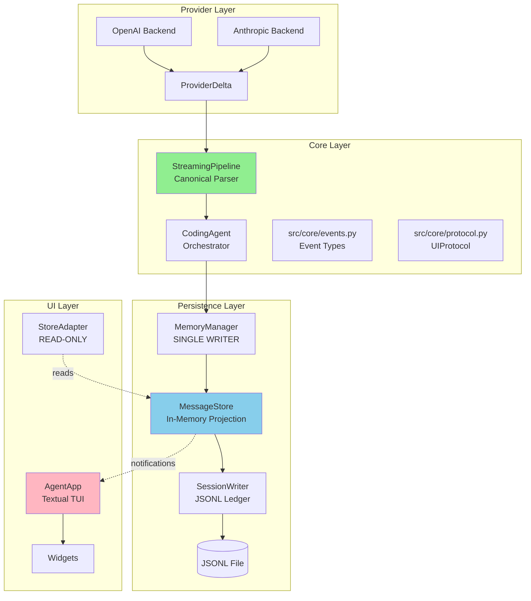
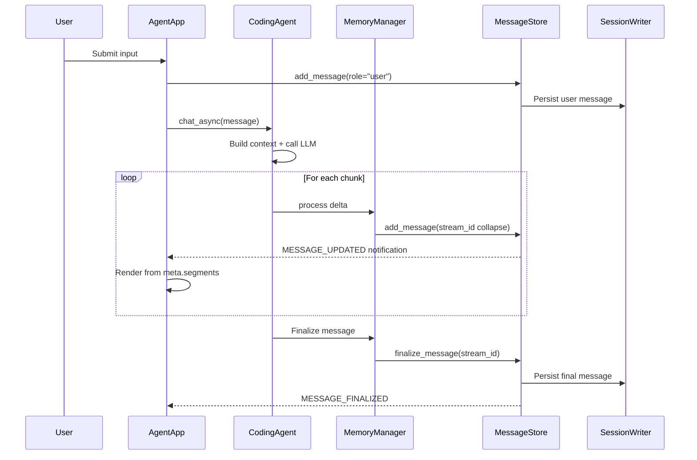
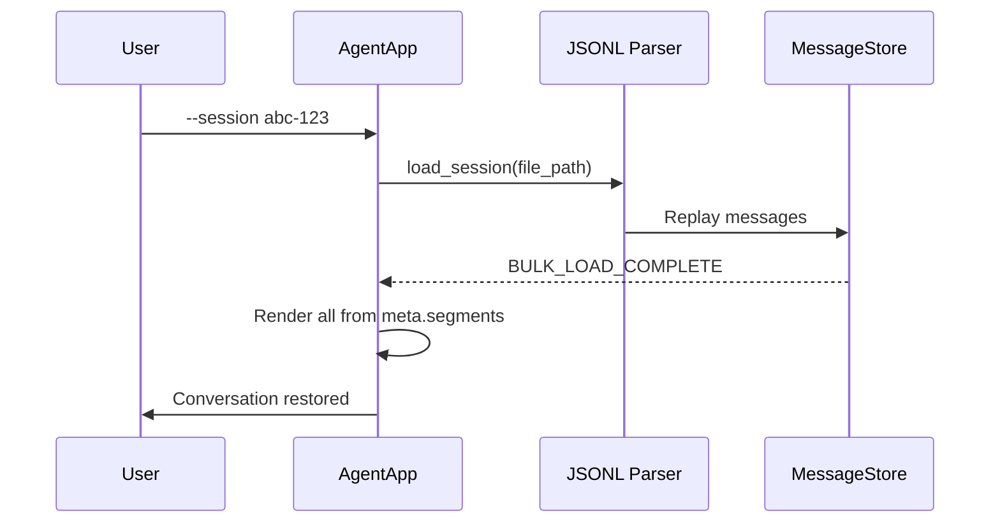
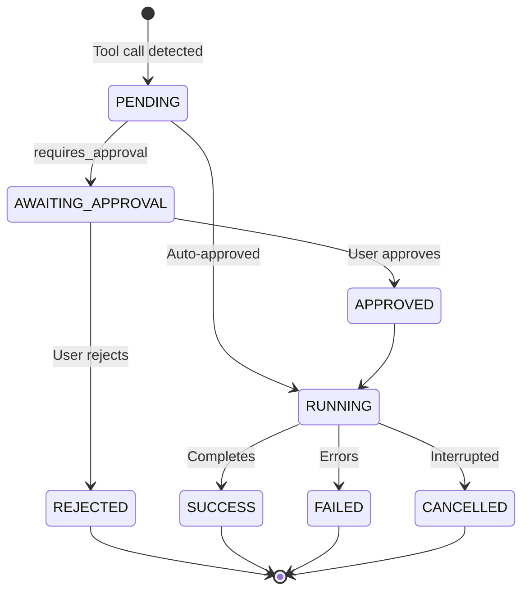
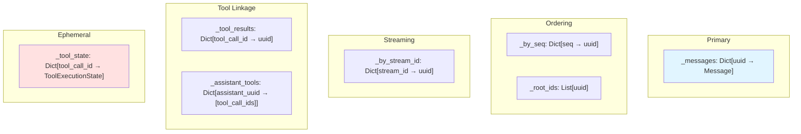
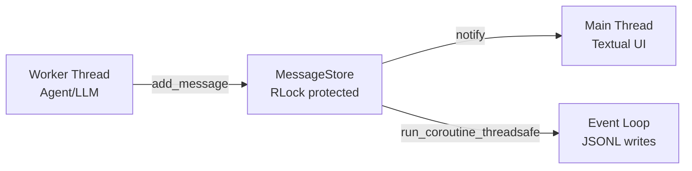
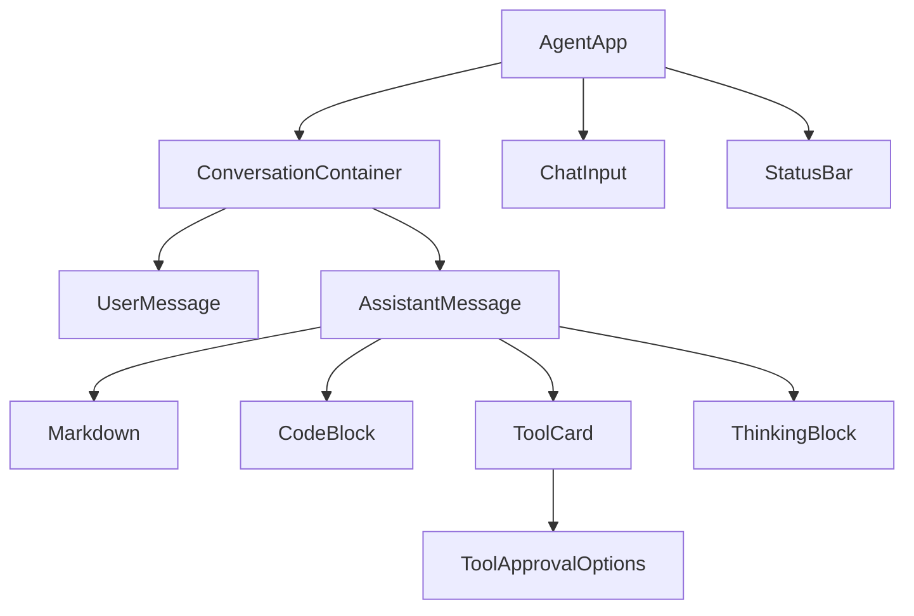

# TUI Persistence Architecture

**Version:** 2.0 | **Updated:** 2026-01-27 | **Status:** Post v0.3.0 refactor

---

## Architecture Overview

```
src/core/           ← Agent, events, protocol, streaming pipeline (ZERO UI imports)
src/memory/         ← MemoryManager (SINGLE WRITER to store)
src/session/store/  ← MessageStore (in-memory projection + reactive notifications)
src/session/persistence/ ← SessionWriter (append-only JSONL)
src/ui/             ← Textual TUI (pure renderer, reads from store)
```

### Dependency Direction

```
Provider Layer → Core Layer → Persistence Layer → UI Layer
                                                    ↑ reads only
```

`src/core/` has **zero imports** from `src/ui/`. All shared types (events, protocol) live in `src/core/` and are re-exported by `src/ui/` shims for backward compatibility.

### Layered Architecture



---

## Component Summary

| Component | File | Role |
|-----------|------|------|
| **CodingAgent** | `src/core/agent.py` | Orchestrates LLM calls, tool execution, memory |
| **StreamingPipeline** | `src/core/streaming/pipeline.py` | Canonical parser: deltas → segments |
| **Event types** | `src/core/events.py` | `StreamStart/End`, `TextDelta`, `ErrorEvent`, etc. |
| **UIProtocol** | `src/core/protocol.py` | Async approval/interrupt coordination |
| **MemoryManager** | `src/memory/memory_manager.py` | SINGLE WRITER to MessageStore |
| **MessageStore** | `src/session/store/memory_store.py` | In-memory projection, reactive notifications |
| **SessionWriter** | `src/session/persistence/writer.py` | Append-only JSONL persistence |
| **AgentApp** | `src/ui/app.py` | Textual TUI, renders from store |
| **StoreAdapter** | `src/ui/store_adapter.py` | READ-ONLY bridge, tracks streaming state |

### Deleted in v0.3.0

| File | Lines | Why |
|------|-------|-----|
| `src/ui/stream_processor.py` | 699 | Replaced by StreamingPipeline in core |
| `src/ui/agent_adapter.py` | 378 | Legacy bridge, no longer needed |
| `src/ui/run_tui.py` | 125 | Legacy entry point |
| `tests/ui/test_stream_processor.py` | 697 | Tests for deleted code |

### Re-export Shims (backward compatibility)

- `src/ui/events.py` → re-exports from `src/core/events.py`
- `src/ui/protocol.py` → re-exports from `src/core/protocol.py`

---

## Data Flows

### Live Streaming



### Session Resume



### Tool Approval



---

## Agent Event Yields (post v0.3.0)

The agent yields only **lifecycle and control events**. All data (text, tool results, tool cards) flows through the store.

| Event | Purpose | Store equivalent? |
|-------|---------|-------------------|
| `StreamStart` | Stream lifecycle start | No (ephemeral) |
| `StreamEnd` | Stream lifecycle end | No (ephemeral) |
| `TextDelta` (control only) | Agent-injected messages (pause, errors) | No (ephemeral) |
| `PausePromptStart/End` | Interactive budget pause | No (user interaction) |
| `ErrorEvent` | Error display + retry | No (ephemeral) |
| `ContextUpdated/Compacted` | Context pressure indicators | No (ephemeral) |

**Removed in v0.3.0:** `TextDelta` (LLM output), `ToolCallStart`, `ToolCallStatus`, `ToolCallResult` — all redundant with store notifications.

---

## MessageStore

### Notifications

```python
class StoreEvent(Enum):
    MESSAGE_ADDED = "message_added"         # New message
    MESSAGE_UPDATED = "message_updated"     # Streaming update (in-memory only)
    MESSAGE_FINALIZED = "message_finalized" # Complete → triggers JSONL persist
    TOOL_STATE_UPDATED = "tool_state_updated" # Tool lifecycle change
    SNAPSHOT_ADDED = "snapshot_added"
    STORE_CLEARED = "store_cleared"
    BULK_LOAD_COMPLETE = "bulk_load_complete"
```

### Index Structure



All lookups are **O(1)** except `get_ordered_messages()` which is O(n log n).

---

## Message Schema

OpenAI-compatible with extensions in `meta`:

```json
{
  "role": "assistant",
  "content": "Here is code:\n\n```python\nprint('hi')\n```",
  "tool_calls": [{"id": "call_abc", "type": "function", "function": {"name": "run_code", "arguments": "{}"}}],
  "meta": {
    "uuid": "msg-123", "seq": 5, "session_id": "session-abc",
    "stream_id": "stream-xyz", "parent_uuid": "user-msg-122",
    "segments": [
      {"type": "text", "content": "Here is code:\n\n"},
      {"type": "code_block", "language": "python", "content": "print('hi')"},
      {"type": "tool_call_ref", "tool_call_id": "call_abc"}
    ]
  }
}
```

**Segment types:** `text`, `code_block`, `tool_call_ref`, `thinking`

**Key rules:**
- `segments` in `meta` (not top-level) → keeps OpenAI compatibility
- Tool calls referenced by ID (not index) → stable across reordering
- `content` has full text for LLM; `segments` is for UI rendering only

---

## UIProtocol

Async coordination between agent and TUI via futures/queues. Lives in `src/core/protocol.py`.

```python
# Agent-side
await ui.wait_for_approval(call_id, tool_name) → ApprovalResult
await ui.wait_for_pause_response() → PauseResult
await ui.wait_for_clarify_response(call_id) → ClarifyResult
ui.check_interrupted() → bool

# UI-side
ui.submit_action(ApprovalResult(...))
ui.submit_action(InterruptSignal())
```

**Auto-approve:** Session-scoped. `"Yes, allow all X"` adds tool to `_auto_approve` set.

---

## Persistence

### JSONL Format

File: `.clarity/sessions/<session-id>/session.jsonl`

One JSON object per line. Append-only. Auto-flush after each write (process-crash safe).

**What gets persisted:**

| Event | Persisted |
|-------|-----------|
| `MESSAGE_FINALIZED` | Yes |
| `compaction_boundary` | Yes |
| `agent_state_snapshot` | Yes |
| `MESSAGE_UPDATED` | No (streaming delta) |

### Thread Safety



---

## TUI Rendering

### Single Rendering Path

All rendering goes through MessageStore notifications. No direct event-to-widget path.

```
Store notification → _handle_store_notification() → create/update widgets from meta.segments
```

### Streaming Modes

1. **Segmented (default):** Accumulate text until boundary (tool card, code block, stream end), render as one Markdown parse. Better UX.
2. **Full (debug):** Render every delta incrementally via Rich `Text` append. Real-time feel but slower.

### Worker Pattern

```python
# Non-blocking: returns immediately, Textual keeps running
self.run_worker(self._stream_response(...), exclusive=True)
```

### Widget Hierarchy



---

## Key Design Decisions

| # | Decision | Rationale |
|---|----------|-----------|
| 1 | StreamingPipeline in core, not UI | Structural parsing is domain logic; enables headless testing |
| 2 | Segments in `meta.segments` | Keeps OpenAI-compatible fields clean |
| 3 | Tool calls by ID, not index | Stable across reordering and filtering |
| 4 | Boundary-only persistence | 10x smaller JSONL, faster replay |
| 5 | Worker pattern for streaming | Textual Workers provide exclusive, ordered execution |
| 6 | Segmented streaming default | O(1) Markdown parse per response, stable UX |
| 7 | Explicit mount for approval widget | Static widgets don't reliably render children from compose() |
| 8 | No timeout on approvals | User may need time to review |
| 9 | Text markers, not emojis | Windows cp1252 encoding crashes on emojis |

---

## Known Issues

### P1 (High)

- **Incomplete tool call recovery:** Error event emitted but not propagated to UI error handler (`src/core/streaming/pipeline.py`)
- **Auto-scroll race:** `is_vertical_scroll_end` checked before content append (`src/ui/app.py`)
- **StatusBar timer cleanup:** Timers may continue after app interrupt (`src/ui/widgets/status_bar.py`)
- **Approval focus:** Redundant timer + call_after_refresh for focus (`src/ui/widgets/tool_card.py`)

### P2 (Medium)

- No input validation on feedback text (control chars allowed)
- No maximum feedback length
- Auto-approve rules not persisted across sessions (by design)
- No input history (Up/Down arrows)
- No copy-to-clipboard for code blocks

---

## Remaining Work

### MemoryManager-StreamingPipeline Integration

Currently the agent accumulates `response_content` as a string and calls `working_memory.add_message()` after stream completes. Target: MemoryManager owns StreamingPipeline, calls `process_provider_delta()` to update store in real-time.

### Testing Gaps

- Replay parity tests (live vs replayed final state)
- Resume tests (continue from loaded session)
- Backward compatibility (legacy JSONL without segments)

---

## File Manifest

```
src/core/
├── agent.py                    # CodingAgent orchestrator (~4200 LOC)
├── events.py                   # Event types (canonical home)
├── protocol.py                 # UIProtocol + action dataclasses (canonical home)
└── streaming/
    ├── pipeline.py             # StreamingPipeline (canonical parser)
    └── state.py                # StreamingState dataclass

src/memory/
└── memory_manager.py           # MemoryManager (SINGLE WRITER)

src/session/
├── store/memory_store.py       # MessageStore (in-memory projection)
├── persistence/
│   ├── parser.py               # JSONL parser
│   └── writer.py               # SessionWriter (JSONL)
└── models/
    ├── base.py                 # SessionContext, generate_uuid
    └── message.py              # Message models, segment types

src/ui/
├── app.py                      # AgentApp (Textual TUI, ~3300 LOC)
├── events.py                   # Re-export shim → src/core/events.py
├── protocol.py                 # Re-export shim → src/core/protocol.py
├── store_adapter.py            # READ-ONLY store bridge
├── messages.py                 # Textual message types
├── styles.tcss                 # Textual CSS
└── widgets/
    ├── message.py              # MessageWidget container
    ├── code_block.py           # Syntax-highlighted code
    ├── tool_card.py            # Tool card + approval UI
    ├── thinking.py             # Collapsible thinking block
    └── status_bar.py           # Bottom status bar
```

---

## Changelog

- **v2.0 (2026-01-27):** Complete rewrite for LLM optimization. Reflects v0.3.0 refactor: agent-UI decoupling, deleted legacy files, single store-driven rendering path.
- **v1.2 (2026-01-25):** Added MessageStore index diagrams, thread safety model, error handling tree.
- **v1.0 (2026-01-24):** Initial architecture document.
