# TUI Architecture with Session Persistence Integration

**Version:** 1.1
**Status:** Current Implementation (as of 2026-01-24)
**Last Updated:** 2026-01-24

---

## Table of Contents

1. [Executive Summary](#executive-summary)
2. [Architecture Overview](#architecture-overview)
3. [Complete Data Flow](#complete-data-flow)
4. [Component Responsibilities](#component-responsibilities)
5. [Message Schema and Segments](#message-schema-and-segments)
6. [Session Persistence Integration](#session-persistence-integration)
7. [Streaming Implementation](#streaming-implementation)
8. [Widget Architecture](#widget-architecture)
9. [Critical Implementation Details](#critical-implementation-details)
10. [Known Issues and Technical Debt](#known-issues-and-technical-debt)
11. [Implementation Status](#implementation-status)

---

## Executive Summary

The AI Coding Agent features a sophisticated TUI (Terminal User Interface) built with the **Textual framework**, integrated with a **unified session persistence architecture** that enables conversation resume across restarts.

### Key Achievements

✅ **Implemented:**
- **CodingAgent** orchestrates LLM, tools, memory, and streaming
- Textual-based TUI with real-time LLM response streaming
- Event-driven architecture with Worker pattern (prevents deadlocks)
- StreamingPipeline as single canonical parser (Agent/Core layer)
- MessageStore projection with JSONL ledger persistence
- StoreAdapter bridges UIEvents to MessageStore
- Tool approval flow with inline UI
- Session resume capability
- Store-driven rendering (TUI renders from MessageStore)

### Critical Component: CodingAgent

The **CodingAgent** (`src/core/agent.py`) is the **orchestration hub** that:
- Receives user input via `chat()` method
- Manages conversation context via MemoryManager
- Calls LLM with streaming support (`generate_with_tools_stream()`)
- Executes tool calls in a loop (max 10 iterations)
- Persists conversation transcript to working memory
- Returns AgentResponse to TUI

**Current Flow:** Agent → LLM → Chunks → TUI (direct streaming)  
**Target Flow:** Agent → LLM → ProviderDelta → StreamingPipeline → MessageStore → TUI

### Architecture Principles

1. **Single Canonical Parser**: StreamingPipeline (in Agent/Core) makes ALL structural decisions
2. **TUI as Pure Renderer**: TUI renders from `meta.segments`, does ZERO parsing
3. **Boundary-Only Persistence**: Only MESSAGE_FINALIZED events persisted to JSONL
4. **Replay Parity**: Final-state only (not streaming animation)
5. **Store-Driven Rendering**: All three modes (live/replay/resume) render from MessageStore

---

## Architecture Overview

### Layered Architecture

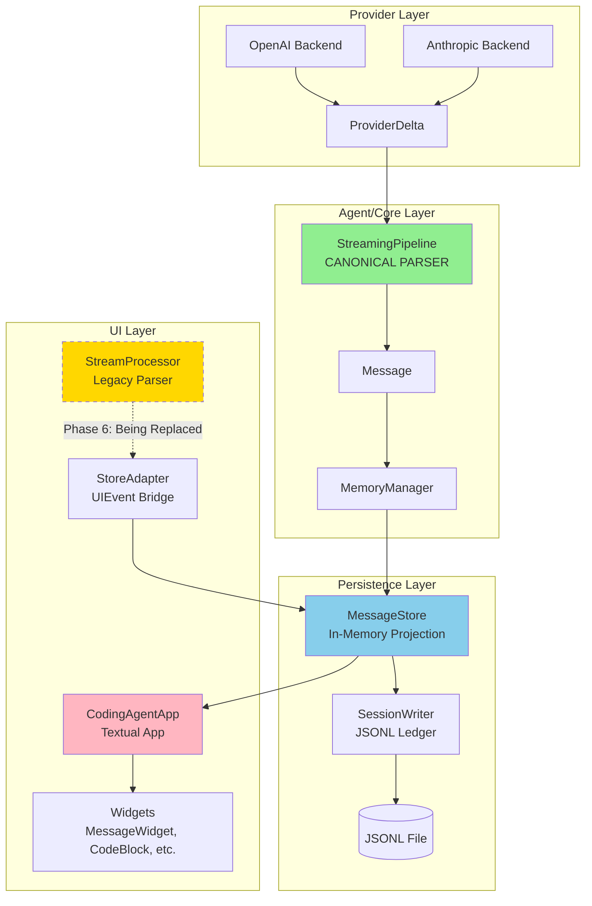

### Current Implementation Status

| Component | Status | Location |
|-----------|--------|----------|
| **StreamingPipeline** | ✅ Implemented | `src/core/streaming/pipeline.py` |
| **MessageStore** | ✅ Implemented | `src/session/store/memory_store.py` |
| **SessionWriter** | ✅ Implemented | `src/session/persistence/writer.py` |
| **StoreAdapter** | ✅ Implemented | `src/ui/store_adapter.py` |
| **CodingAgentApp** | ✅ Implemented | `src/ui/app.py` |
| **Store-Driven Rendering** | 🚧 Partial (feature flag) | `TUI_RENDER_FROM_STORE=true` |
| **StreamProcessor** | ⚠️ Legacy (being phased out) | `src/ui/stream_processor.py` |

---

## Complete Data Flow

### Live Streaming Flow

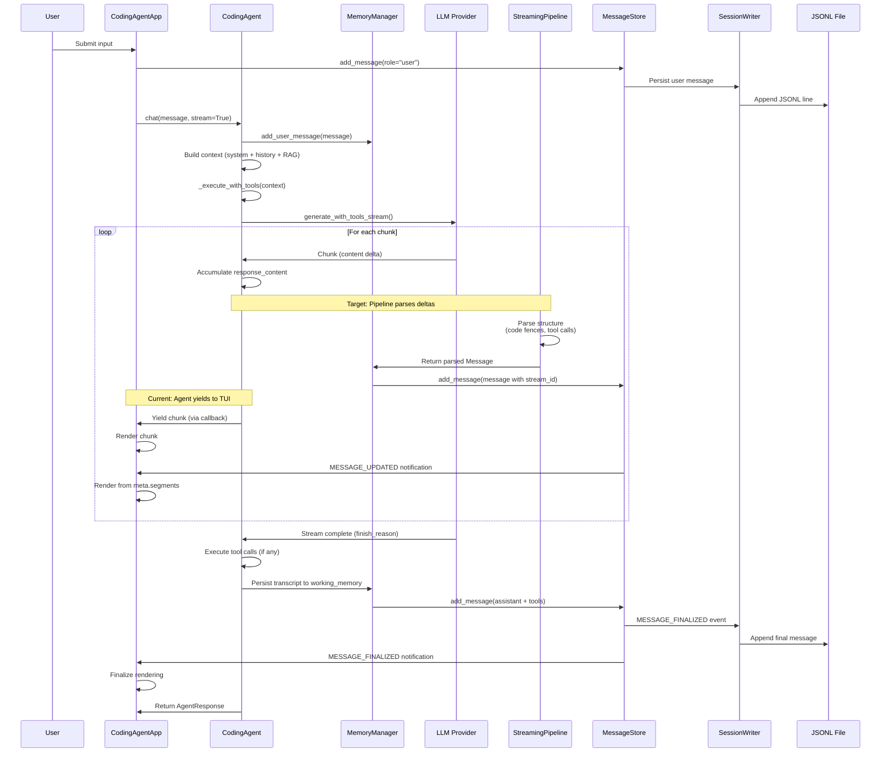

### Session Resume Flow

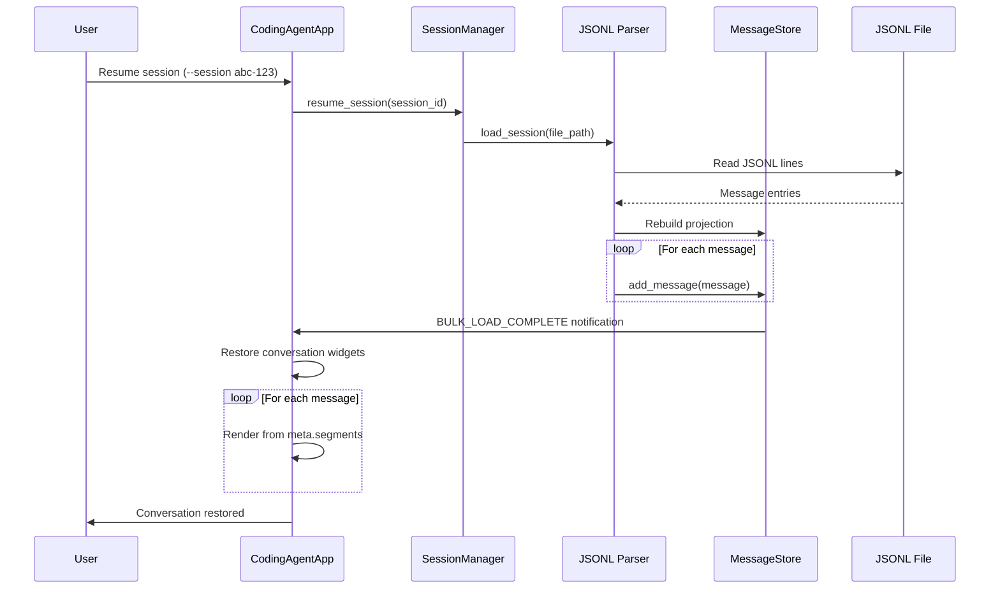

### Tool Approval Flow

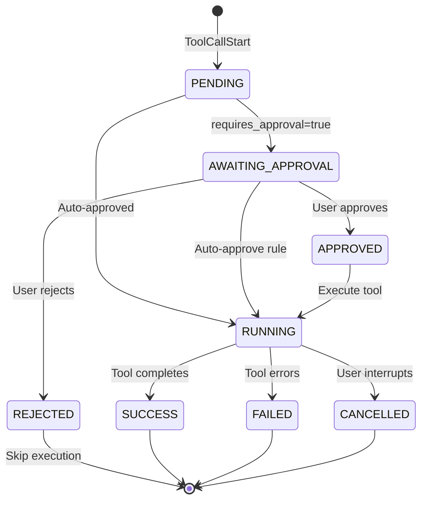

---


## Component Responsibilities

### Provider Layer

#### OpenAI Backend (`src/llm/openai_backend.py`)
#### Anthropic Backend (`src/llm/anthropic_backend.py`)

**Responsibility:** Convert provider streaming events to `ProviderDelta` objects.

**Contract:**
- ✅ Emit `ProviderDelta` with `stream_id` on every delta
- ✅ Never emit UIEvents
- ✅ Never decide message boundaries (except `finish_reason`)
- ✅ Never parse markdown or assemble structures

**ProviderDelta Schema:**
```python
@dataclass
class ProviderDelta:
    """Raw delta from LLM provider. No structural decisions."""
    stream_id: str                              # Self-describing, stable across deltas
    text_delta: Optional[str] = None            # Raw text chunk
    tool_call_delta: Optional[ToolCallDelta] = None  # Incremental tool call
    thinking_delta: Optional[str] = None        # Native thinking (if provider supports)
    finish_reason: Optional[str] = None         # "stop", "tool_calls", etc.
    usage: Optional[Dict] = None                # Token counts (on finish)
```

---

### Agent/Core Layer

#### CodingAgent (`src/core/agent.py`)

**Responsibility:** Main orchestration layer. Coordinates LLM, tools, memory, and streaming.

**Key Features:**
- ✅ LLM-first decision making (tool_choice="auto")
- ✅ Native function calling loop with tool execution
- ✅ Memory management via MemoryManager
- ✅ Streaming support with progress callbacks
- ✅ Hook system integration (user prompt submit, etc.)
- ✅ Workflow and direct execution modes
- ✅ RAG integration for codebase context

**Main Entry Points:**
```python
class CodingAgent:
    def chat(self, message: str, stream: bool = True, 
             use_rag: bool = True, 
             on_stream_start: Optional[Callable] = None) -> AgentResponse:
        """
        Interactive chat with LLM-first decision making.
        
        Flow:
        1. Add user message to memory
        2. Build context (system prompt + conversation history + RAG)
        3. Execute with tool calling loop (_execute_with_tools)
        4. Persist transcript to working memory
        5. Return AgentResponse
        """
    
    def _execute_with_tools(self, context: List[Dict], 
                           max_iterations: int = 3,
                           stream: bool = False,
                           on_stream_start: Optional[Callable] = None) -> ToolExecutionResult:
        """
        Execute LLM with native function calling loop.
        
        Streaming Flow:
        - Calls llm.generate_with_tools_stream()
        - Yields chunks as they arrive
        - Invokes on_stream_start callback on first chunk
        - Accumulates response_content
        - Executes tool calls if present
        - Returns ToolExecutionResult with ordered transcript
        """
```

**Integration with Persistence:**
```python
# In chat() method (line 1977-1997)
# Persist the ordered transcript to working memory
for msg in execution_result.turn_messages:
    if msg["role"] == "assistant":
        self.memory.working_memory.add_message(
            role=MessageRole.ASSISTANT,
            content=msg.get("content", ""),
            metadata={"tool_calls": msg.get("tool_calls")}
        )
    elif msg["role"] == "tool":
        self.memory.working_memory.add_message(
            role=MessageRole.TOOL,
            content=msg.get("content", ""),
            metadata={
                "tool_call_id": msg.get("tool_call_id"),
                "name": msg.get("name")
            }
        )
```

**Note:** The agent currently uses `working_memory.add_message()` directly. The target architecture (UNIFIED_PERSISTENCE_ARCHITECTURE_FINAL.md) plans to integrate StreamingPipeline here for canonical parsing.

---

#### StreamingPipeline (`src/core/streaming/pipeline.py`)

**Responsibility:** Single canonical parser. Converts raw deltas to fully-parsed segments.

**Owned by:** Agent/Core layer (not TUI)

**Detects and emits:**
- ✅ Code blocks (``` fence detection)
- ✅ Tool calls (JSON assembly from incremental deltas)
- ✅ Thinking blocks (`<thinking>` tags or native `thinking_delta`)
- ✅ Plain text segments

**Key Methods:**
```python
class StreamingPipeline:
    def __init__(self, session_id: str, parent_uuid: Optional[str] = None): ...

    def process_delta(self, delta: ProviderDelta) -> Optional[Message]:
        """
        Process a single provider delta.
        Returns finalized Message when complete, None during streaming.
        """

    def get_current_state(self) -> Optional[Message]:
        """Get current in-flight message state for live UI updates."""
```

**Rules:**
- ✅ Never writes to disk directly
- ✅ Emits complete Message objects (with segments) to MemoryManager
- ✅ Maintains streaming state keyed by `stream_id`

---

#### MemoryManager (`src/memory/memory_manager.py`)

**Responsibility:** Single writer to MessageStore. Maintains LLM context.

**Integration Status:** 🚧 Partial (StreamingPipeline integration in progress)

**Key Methods:**
```python
class MemoryManager:
    def set_message_store(self, store: MessageStore, session_id: str) -> None:
        """Link to MessageStore for unified data flow."""

    def add_user_message(self, content: str) -> Message:
        """Add user message (immediate finalization)."""

    def add_tool_result(self, tool_call_id: str, content: str,
                        status: str, duration_ms: int, exit_code: int) -> Message:
        """Add tool result message."""
```

---

### Persistence Layer

#### MessageStore (`src/session/store/memory_store.py`)

**Responsibility:** In-memory projection. Single source of truth for rendering.

**Key Features:**
- ✅ O(1) message lookup by UUID
- ✅ Ordering by seq (line number / append order)
- ✅ Assistant message collapsing by stream_id (latest wins)
- ✅ Tool result indexing for O(1) linkage
- ✅ Reactive subscriptions for UI updates

**API:**
```python
class MessageStore:
    def add_message(self, message: Message) -> None:
        """
        Add a message to the store.

        Handles:
        - Seq uniqueness assertion
        - Assistant message collapsing by stream_id (subsequent calls
          with same stream_id update the existing message)
        - Index maintenance
        - Sidechain tracking
        - Compaction boundary detection
        - Tool result indexing

        Emits:
        - MESSAGE_ADDED: First time a message/stream_id is added
        - MESSAGE_UPDATED: When collapsing an existing stream_id
        """

    def finalize_message(self, stream_id: str) -> Optional[Message]:
        """
        Mark a streaming message as finalized.

        Call this when a stream completes to emit MESSAGE_FINALIZED.
        The message should already exist in the store via add_message().

        Returns:
            The finalized message, or None if not found
        """

    def next_seq(self) -> int:
        """
        Get next sequence number for runtime appends.
        This is the SINGLE AUTHORITY for seq allocation.
        """
```

**Notifications:**
```python
class StoreEvent(Enum):
    MESSAGE_ADDED = "message_added"           # New message added
    MESSAGE_UPDATED = "message_updated"       # Streaming update (frequent, in-memory only)
    MESSAGE_FINALIZED = "message_finalized"   # Message complete (triggers persistence)
    SNAPSHOT_ADDED = "snapshot_added"         # File snapshot added
    STORE_CLEARED = "store_cleared"           # Store reset
    BULK_LOAD_COMPLETE = "bulk_load_complete" # Replay finished
    TOOL_STATE_UPDATED = "tool_state_updated" # Tool execution state changed
```

**Internal Index Structure:**

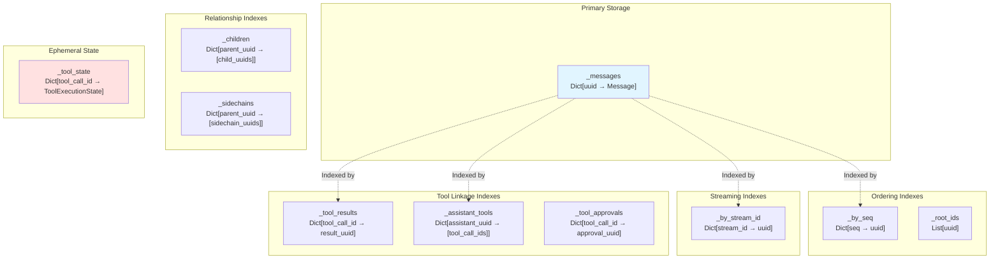

**Index Lookup Examples:**

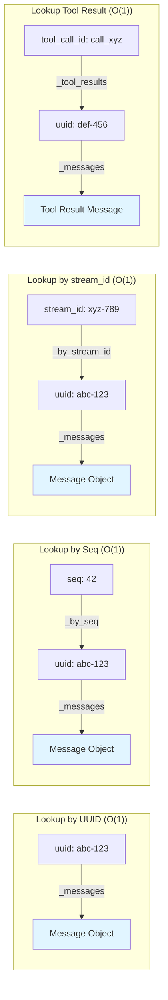

**Performance Characteristics:**

| Operation | Complexity | Notes |
|-----------|-----------|-------|
| `add_message()` | O(1) | Hash table insert + index updates |
| `get_message(uuid)` | O(1) | Direct hash lookup |
| `get_by_seq(seq)` | O(1) | Index lookup |
| `get_tool_result(id)` | O(1) | Index lookup |
| `get_ordered_messages()` | O(n log n) | Sort by seq |
| `get_llm_context()` | O(n) | Filter + transform |

---

#### SessionWriter (`src/session/persistence/writer.py`)

**Responsibility:** Append-only JSONL persistence.

**Policy:** Boundary-only (default)

**Key Features:**
- ✅ Thread-safe via `run_coroutine_threadsafe()`
- ✅ Drain pending writes on close (v3.1 Patch 3)
- ✅ Auto-flush after each event (process-crash safe)
- ✅ Binds to MessageStore for reactive persistence

**What gets persisted (BOUNDARY_ONLY):**

| Event | Persisted | Description |
|-------|-----------|-------------|
| `MESSAGE_FINALIZED` (user) | ✅ YES | User submits message |
| `MESSAGE_FINALIZED` (assistant) | ✅ YES | LLM completes response |
| `MESSAGE_FINALIZED` (tool) | ✅ YES | Tool execution completes |
| `compaction_boundary` | ✅ YES | Context compaction marker |
| `agent_state_snapshot` | ✅ YES | Todo state, etc. |
| `MESSAGE_UPDATED` | ❌ NO | Streaming delta |

**Durability Guarantee:**
- After `flush()` returns, data survives **PROCESS CRASH**
- NOT guaranteed: power-loss durability (no `os.fsync`)

---

### UI Layer

#### CodingAgentApp (`src/ui/app.py`)

**Responsibility:** Main Textual application orchestration.

**Key Features:**
- ✅ Composes UI layout (conversation, input, status bar)
- ✅ Handles UIEvents from StreamProcessor and dispatches to widgets
- ✅ Manages streaming state and auto-scroll
- ✅ Coordinates with UIProtocol for approvals
- 🚧 Store-driven rendering (feature flag: `TUI_RENDER_FROM_STORE`)

**Streaming Modes:**
1. **Segmented Streaming (Default)**: Accumulate text until boundaries, render once as Markdown
2. **Full Streaming (Debug)**: Render every delta incrementally

**Worker Pattern:**
```python
async def on_input_submitted_message(self, message: InputSubmittedMessage):
    # Start streaming in Worker (run_worker, exclusive=True)
    self._stream_worker = self.run_worker(
        self._stream_response(user_input, ui_protocol),
        exclusive=True  # Prevents concurrent streams
    )
    # Return immediately (don't await!) -> Textual keeps running
```

---

#### StoreAdapter (`src/ui/store_adapter.py`)

**Responsibility:** READ-ONLY bridge between UIEvents and MessageStore. Tracks streaming state for UI rendering purposes.

**IMPORTANT:** StoreAdapter is READ-ONLY. Per the unified persistence architecture, **MemoryManager is the SINGLE WRITER** to the MessageStore. The StoreAdapter tracks streaming state and provides user message helpers, but store writes are handled by MemoryManager.

**Architecture:**
```
StreamProcessor -> UIEvents -> StoreAdapter (tracks state)
                                    |
                                    v
                            MemoryManager (SINGLE WRITER)
                                    |
                                    v
                              MessageStore
                                    |
                                    v
                            SessionWriter -> JSONL
```

**Key Features:**
- ✅ Consumes UIEvents at the same boundaries as the TUI
- ✅ Tracks streaming state (text, code, thinking, tool calls)
- ✅ Provides `add_user_message()` convenience method
- ✅ READ-ONLY: Does not write to MessageStore directly (MemoryManager does)

**State Tracking:**
```python
@dataclass
class StreamingState:
    stream_id: str
    session_id: str
    parent_uuid: Optional[str]

    # Content accumulation
    text_content: str = ""
    thinking_content: str = ""
    code_content: str = ""
    code_language: str = ""

    # Segments for interleaving order
    segments: List[Segment] = field(default_factory=list)

    # Tool calls
    tool_calls: List[ToolCall] = field(default_factory=list)
```

---

#### StreamProcessor (`src/ui/stream_processor.py`)

**Status:** ⚠️ Legacy (being phased out in favor of StreamingPipeline)

**Current Role:** State machine for parsing raw chunks into UIEvents

**Replacement Plan:**
- Phase 6: StreamingPipeline becomes canonical parser
- TUI renders from MessageStore (via StoreAdapter)
- StreamProcessor deprecated

---

#### UIProtocol (`src/ui/protocol.py`)

**Responsibility:** Bidirectional coordination (approvals, interrupts, auto-approve).

**User Actions (UI → Agent):**
```python
@dataclass(frozen=True)
class ApprovalResult:
    call_id: str
    approved: bool
    auto_approve_future: bool = False  # "Don't ask again for this tool"
    feedback: str | None = None        # Modified instructions

@dataclass(frozen=True)
class InterruptSignal:
    """User interrupted (Ctrl+C)"""
    pass
```

**Key Methods:**
```python
class UIProtocol:
    # Agent-side methods
    async def wait_for_approval(call_id, tool_name, timeout=None) -> ApprovalResult
    def check_interrupted() -> bool
    
    # UI-side methods
    def submit_action(action: UserAction) -> None
    def is_auto_approved(tool_name) -> bool
    def add_auto_approve(tool_name) -> None
```

---


## Message Schema and Segments

### Canonical Message Structure

The message schema is **OpenAI-compatible** with extensions in `meta`:

```json
{
  "role": "assistant",
  "content": "Here is code:\n\n```python\nprint('hi')\n```\n\nLet me run it.",
  "tool_calls": [
    {
      "id": "call_abc123",
      "type": "function",
      "function": {
        "name": "run_code",
        "arguments": "{\"code\": \"print('hi')\"}"
      }
    }
  ],
  "meta": {
    "schema_version": 1,
    "uuid": "msg-uuid-123",
    "seq": 5,
    "timestamp": "2026-01-24T10:30:00Z",
    "session_id": "session-abc",
    "parent_uuid": "user-msg-uuid-122",
    "is_sidechain": false,
    "stream_id": "stream-xyz",
    "stop_reason": "tool_use",
    "usage": { "input_tokens": 100, "output_tokens": 50 },
    "provider": "openai",
    "model": "gpt-4.1",
    "segments": [
      { "type": "text", "content": "Here is code:\n\n" },
      { "type": "code_block", "language": "python", "content": "print('hi')" },
      { "type": "text", "content": "\n\nLet me run it." },
      { "type": "tool_call_ref", "tool_call_id": "call_abc123" }
    ],
    "thinking": "optional thinking content..."
  }
}
```

**Key Design Decisions:**
- ✅ `segments` lives in `meta.segments` (not top-level) to keep OpenAI-compatible fields clean
- ✅ `tool_calls` array is the single source of truth for tool call data
- ✅ Segments reference tool calls by ID, not index (stable across reordering)
- ✅ `content` contains full text (including code as markdown) for LLM context
- ✅ `meta.segments` is for UI rendering only, stripped before LLM context

---

### Segment Types

```python
@dataclass
class TextSegment:
    """Plain text content."""
    type: Literal["text"] = "text"
    content: str = ""

@dataclass
class CodeBlockSegment:
    """Code block with language."""
    type: Literal["code_block"] = "code_block"
    language: str = ""      # Empty string if not specified
    content: str = ""

@dataclass
class ToolCallRefSegment:
    """Reference to tool call by ID (not index)."""
    type: Literal["tool_call_ref"] = "tool_call_ref"
    tool_call_id: str = ""  # References tool_calls[].id

@dataclass
class ThinkingSegment:
    """Extended thinking/reasoning content."""
    type: Literal["thinking"] = "thinking"
    content: str = ""

# Union type for deserialization
Segment = Union[TextSegment, CodeBlockSegment, ToolCallRefSegment, ThinkingSegment]
```

**Why `tool_call_id` not `tool_call_index`:**
- Index is fragile if tool_calls are reordered, filtered, or partially present during streaming
- ID is stable across provider adapters and matches OpenAI tool-call model
- TUI builds a `{id -> tool_call}` map once per message, then renders via ref

---

### Tool Result Message

Tool results are separate messages with `role="tool"`:

```json
{
  "role": "tool",
  "tool_call_id": "call_abc123",
  "content": "Hello\n",
  "meta": {
    "schema_version": 1,
    "uuid": "msg-uuid-124",
    "seq": 6,
    "timestamp": "2026-01-24T10:30:05Z",
    "session_id": "session-abc",
    "parent_uuid": "msg-uuid-123",
    "is_sidechain": false,
    "status": "success",
    "duration_ms": 150,
    "exit_code": 0
  }
}
```

**Rule:** Tool results are canonical as `role="tool"` messages. No inline "tool result segment" needed - TUI correlates by `tool_call_id`.

---

## Session Persistence Integration

### Hook Points in TUI

The TUI integrates with session persistence at key lifecycle events:

#### 1. User Messages

**Location:** `CodingAgentApp.on_input_submitted_message()` (app.py ~line 400)

```python
async def on_input_submitted_message(self, message: InputSubmittedMessage):
    user_input = message.content.strip()
    attachments = message.attachments

    # UI: Mount user message widget
    await self._add_user_message(user_input + attachment_summary)

    # HOOK POINT: Persist user message
    if self.session_manager and self.session_manager.is_active:
        self.session_manager.store.add_message(
            role="user",
            content=user_input,
            attachments=[att.to_dict() for att in attachments],
        )

    # Start streaming
    self._stream_worker = self.run_worker(...)
```

---

#### 2. Assistant Messages

**Location:** `CodingAgentApp._handle_event()` (StreamStart/StreamEnd)

```python
case StreamStart():
    msg = AssistantMessage()
    self._current_message = msg
    await conversation.mount(msg)
    # HOOK POINT: Generate message ID for tracking
    self._current_message_id = generate_uuid()

case StreamEnd(total_tokens=tokens, duration_ms=duration):
    await self._flush_segment()
    self._finalize_current_message(msg)
    # HOOK POINT: Persist complete assistant message
    content = self._current_message.get_plain_text()
    if self.session_manager:
        self.session_manager.store.add_message(
            id=self._current_message_id,
            role="assistant",
            content=content,
            token_count=tokens,
            duration_ms=duration,
        )
```

---

#### 3. Tool Calls

**Location:** `CodingAgentApp._handle_event()` (ToolCallStart/ToolCallResult)

```python
case ToolCallStart(call_id, name, arguments, requires_approval):
    card = self._current_message.add_tool_card(...)
    self._tool_cards[call_id] = card
    # HOOK POINT: Persist tool call
    if self.session_manager:
        self.session_manager.store.add_tool_call(
            message_id=self._current_message_id,
            call_id=call_id,
            name=name,
            arguments=arguments,
        )

case ToolCallResult(call_id, status, result, error, duration_ms):
    card.set_result(result, duration_ms)
    # HOOK POINT: Persist tool result
    if self.session_manager:
        self.session_manager.store.update_tool_result(
            call_id=call_id,
            status=status.value,
            result=result,
            error=error,
            duration_ms=duration_ms,
        )
```

---

### Session Resume Flow

To restore a conversation from a persisted session:

```python
# In CodingAgentApp
async def _restore_conversation(self) -> None:
    """Restore conversation from session store."""
    if not self.session_manager or not self.session_manager.store:
        return

    messages = self.session_manager.store.get_ordered_messages()
    conversation = self.query_one("#conversation")

    for msg in messages:
        if msg.role == "user":
            # Restore user message
            widget = UserMessage()
            await conversation.mount(widget)
            await widget.add_text(msg.content)

        elif msg.role == "assistant":
            # Restore assistant message
            widget = AssistantMessage()
            await conversation.mount(widget)

            # Restore content blocks from segments
            for segment in msg.meta.segments or []:
                if segment.type == "text":
                    await widget.add_text(segment.content)
                elif segment.type == "code_block":
                    code_block = widget.start_code_block(segment.language)
                    code_block.set_code(segment.content)
                    widget.end_code_block()
                elif segment.type == "tool_call_ref":
                    # Look up tool call by ID
                    tc = next((t for t in msg.tool_calls if t.id == segment.tool_call_id), None)
                    if tc:
                        card = widget.add_tool_card(
                            call_id=tc.id,
                            tool_name=tc.function.name,
                            args=json.loads(tc.function.arguments),
                            requires_approval=False,  # Don't re-approve
                        )
                        # Restore tool result if available
                        # (from separate tool result message)

    # Scroll to end
    conversation.scroll_end(animate=False)
```

---

### JSONL Format

The session file (`.clarity/sessions/<session-id>/session.jsonl`) uses append-only JSONL format where each line is a complete message object:

```jsonl
{"role": "user", "meta": {"schema_version": 1, "uuid": "e9464dec-...", "seq": 1, "timestamp": "2026-01-24T00:05:50Z", "session_id": "session-20260123-190537-cbfb5eb8", "parent_uuid": null, "is_sidechain": false}, "content": "Hello"}
{"role": "assistant", "meta": {"schema_version": 1, "uuid": "9a400f0b-...", "seq": 2, "timestamp": "2026-01-24T00:05:56Z", "session_id": "session-20260123-190537-cbfb5eb8", "parent_uuid": "e9464dec-...", "is_sidechain": false, "stream_id": "stream_1157ab4a8900", "provider": "openai", "model": "claude-sonnet-4-5-20250929", "stop_reason": "tool_use", "usage": {"input_tokens": 12242, "output_tokens": 143}, "segments": [...]}, "content": "...", "tool_calls": [...]}
{"role": "tool", "meta": {"schema_version": 1, "uuid": "53664339-...", "seq": 4, "timestamp": "2026-01-23T22:50:44Z", "session_id": "session-20260123-174900-6a527ffc", "parent_uuid": "2147f644-...", "is_sidechain": false, "status": "success", "duration_ms": 157}, "content": "...", "tool_call_id": "toolu_vrtx_01RBF31Y..."}
{"role": "system", "meta": {"schema_version": 1, "uuid": "7f426063-...", "seq": 12, "timestamp": "2026-01-23T22:51:49Z", "session_id": "...", "parent_uuid": null, "is_sidechain": false, "event_type": "tool_approval", "include_in_llm_context": false, "extra": {"tool_call_id": "...", "tool_name": "write_file", "approved": true, "action": "yes"}}, "content": "[Tool approved: write_file]"}
```

**Message Structure:**
- `role`: One of "user", "assistant", "tool", or "system"
- `content`: The message content (text for user/assistant, tool output for tool)
- `meta`: Metadata object containing:
  - `uuid`: Unique message identifier
  - `seq`: Sequence number for ordering
  - `timestamp`: ISO timestamp
  - `session_id`: Session identifier
  - `parent_uuid`: Parent message UUID (for threading)
  - `stream_id`: (assistant only) For collapse semantics
  - `segments`: (assistant only) Parsed content segments
  - `status`: (tool only) "success", "error", "rejected", "interrupted"
  - `duration_ms`: (tool only) Execution time
- `tool_calls`: (assistant only) Array of tool call objects
- `tool_call_id`: (tool only) References the tool call this responds to

**Key Properties:**
- ✅ Append-only (never modify existing lines)
- ✅ Each line is a complete JSON object with `role` and `meta`
- ✅ Chronological ordering by `seq`
- ✅ Self-describing (role + meta.event_type for system events)
- ✅ Process-crash safe (auto-flush after each write)

---


## Streaming Implementation

### Event Flow State Machine

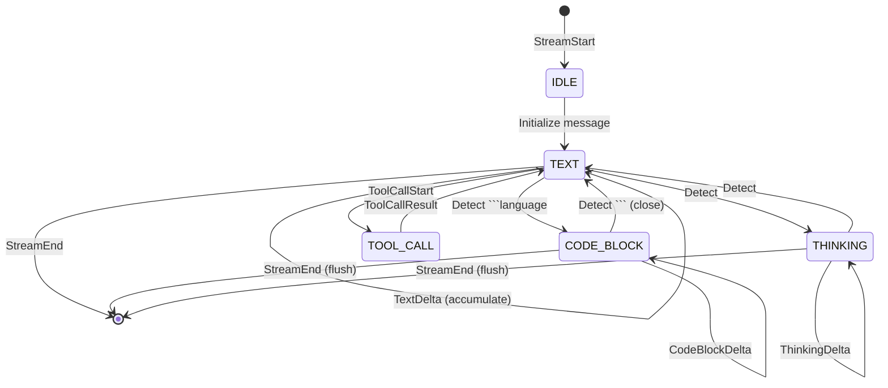

### Streaming Modes

#### Mode 1: Segmented Streaming (Default)

**When to use:** Production, user-facing (better UX)

**How it works:**
1. Text accumulates in `_segment_chunks[]` buffer
2. NO UI updates until a **boundary** occurs:
   - Tool card
   - Code block
   - Thinking block
   - Stream end
3. At boundary: all accumulated text rendered as Markdown (one parse)
4. Gives stable, readable chunks instead of flickering

```python
# TextDelta events just accumulate
case TextDelta(content=text):
    self._segment_chunks.append(text)
    self._segment_chars += len(text)

# At boundary: flush and render
def _flush_segment(self) -> None:
    text = "".join(self._segment_chunks)
    self._current_message.add_text(text)  # One Markdown parse
    self._segment_chunks.clear()
```

**Pros:** Fast Markdown parsing (O(1) per response), stable UX  
**Cons:** Slight latency before first visible output

---

#### Mode 2: Full Streaming (Debug)

**When to use:** Development, testing, debugging

**How it works:**
1. Text accumulates in `_delta_buffer[]` (up to 512 chars or 50ms)
2. Flushed incrementally via `append_streaming_text()`
3. Uses Rich `Text` object (O(1) amortized append)
4. Converted to Markdown at stream end (finalize_streaming_text)

```python
if self._buffer_len() >= self._flush_chars_threshold:
    await self._flush_deltas()  # Append to Static widget
else:
    self._schedule_flush()      # Timer-based flush
```

**Pros:** Live feedback on every chunk, real-time feel  
**Cons:** Multiple Markdown parses = slower for long responses

---

### Content Buffering Strategy

#### Text Buffering (in TEXT state)

Emit TextDelta when:
- Buffer ends with `\n` (natural break)
- Buffer ends with `.`, `!`, `?`, `:` + space (sentence boundary)
- Max latency exceeded (150ms, prevent UI starvation)
- Buffer > 500 chars (prevent memory issues)

#### Code Buffering (in CODE_BLOCK state)

1. Accumulate in `_code_buffer`
2. Emit CodeBlockDelta for safe content (except potential fence markers)
3. Keep 1-3 backticks at end of buffer (might be start of closing fence)
4. On fence close, emit remaining code + CodeBlockEnd

**Edge Cases Handled:**
```python
# Fence split across chunks
if safe_to_emit.endswith('\n`'):           # \n` -> wait
    safe_to_emit = safe_to_emit[:-2]
elif safe_to_emit.endswith('\n``'):        # \n`` -> wait
    safe_to_emit = safe_to_emit[:-3]
elif safe_to_emit.endswith('\n```'):       # \n``` -> wait (might close)
    return  # Don't emit, might be fence
```

---

### Tool Call Accumulation

**Problem Solved:** Prevent raw JSON from leaking to UI

**Strategy:**
```python
class ToolCallAccumulator:
    index: int
    id: str = ""
    name: str = ""
    arguments: str = ""

    def is_complete(self) -> bool:
        # Only complete when:
        # 1. name is non-empty
        # 2. arguments is non-empty
        # 3. arguments is valid JSON
        ...

# Accumulate incrementally from stream
for tc_delta in chunk.choices[0].delta.tool_calls:
    acc = _tool_calls[tc_delta.index]
    acc.name += tc_delta.function.name  # Partial name
    acc.arguments += tc_delta.function.arguments  # Partial JSON

    if acc.is_complete():
        # Only now, emit ToolCallStart with parsed args
        yield ToolCallStart(..., arguments=json.loads(acc.arguments))
```

---

## Widget Architecture

### Widget Hierarchy

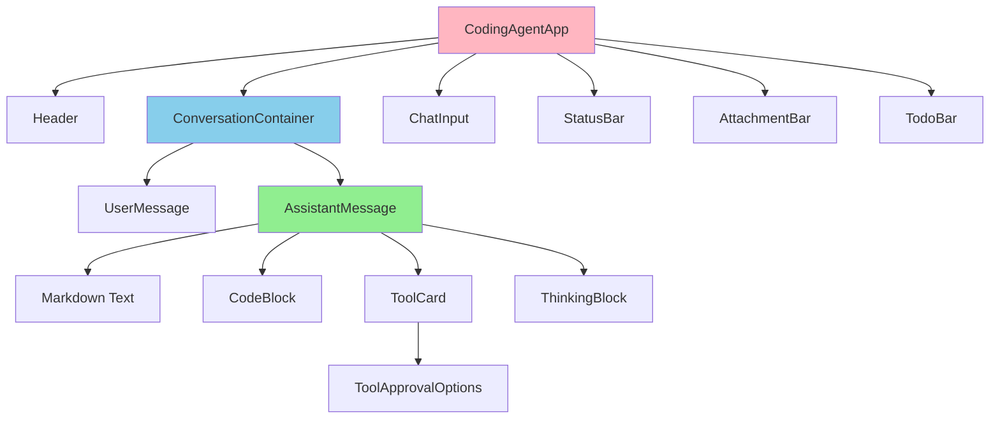

---

### MessageWidget (`src/ui/widgets/message.py`)

**Purpose:** Container for multiple content blocks in a single message

**Key Methods:**
```python
class MessageWidget(Static):
    async def add_text(self, content: str) -> None:
        """Add markdown text (renders immediately via Markdown widget)."""
        
    def start_streaming_text(self) -> None:
        """Start live text rendering using Rich Text (O(1) append)."""
        
    def append_streaming_text(self, content: str) -> None:
        """Append to streaming text buffer."""
        
    def finalize_streaming_text(self) -> None:
        """Convert streaming text to Markdown."""
        
    def start_code_block(self, lang: str) -> CodeBlock:
        """Start new code block."""
        
    def append_code(self, content: str) -> None:
        """Append to current code block."""
        
    def end_code_block(self) -> None:
        """Finalize code block."""
        
    def add_tool_card(self, call_id, tool_name, args, requires_approval) -> ToolCard:
        """Mount ToolCard."""
        
    def start_thinking(self) -> None:
        """Start thinking block."""
        
    def append_thinking(self, content: str) -> None:
        """Append to thinking block."""
        
    def end_thinking(self, token_count: int) -> None:
        """Finalize thinking block."""
```

**State Tracking:**
```python
self._current_markdown: Markdown | None          # Current text block
self._current_code: CodeBlock | None             # Current code block
self._current_thinking: ThinkingBlock | None     # Current thinking
self._tool_cards: dict[str, ToolCard]            # All tool cards by ID
self._blocks: list[Static]                       # All blocks in order
self._streaming_widget: Static | None            # Temporary streaming preview
self._streaming_text: Text | None                # Rich Text for O(1) appends
```

**Three Roles:**
1. **UserMessage** - Role="user", border-left color primary
2. **AssistantMessage** - Role="assistant", border-left color secondary
3. **SystemMessage** - Role="system", border-left color warning, opacity 0.8

---

### CodeBlock (`src/ui/widgets/code_block.py`)

**Purpose:** Display code with syntax highlighting and streaming indicator

**Key Attributes:**
```python
code: str                    # Accumulated code content (reactive)
language: str                # Language for syntax highlighting (reactive)
is_streaming: bool           # True during streaming, False when complete (reactive)
```

**Rendering:**
- **Empty/Streaming:** Placeholder `"..."` in dim italic
- **With Content:** Rich `Syntax` widget with monokai theme, line numbers, word wrap
- **Border:** Yellow while streaming, green when complete
- **Title:** Language name + `[dim]...[/dim]` indicator while streaming

**Methods:**
```python
def append(self, content: str) -> None:
    """Add code incrementally."""
    
def finalize(self) -> None:
    """Mark complete, change border to green."""
    
@property
def line_count(self) -> int:
    """Count lines in code."""
```

---

### ToolCard (`src/ui/widgets/tool_card.py`)

**Purpose:** Display tool call status, arguments, results, and approval UI

**Compact Format:**
```
[+] read_file(example.py)  mode="text"
    (5 lines) [42ms]
```

**Status Icons (Text, Windows-safe):**
```python
STATUS_CONFIG = {
    PENDING:           ("o", "yellow"),
    AWAITING_APPROVAL: ("?", "cyan"),
    APPROVED:          (">", "blue"),
    REJECTED:          ("x", "dim"),
    RUNNING:           ("*", "yellow"),
    SUCCESS:           ("+", "green"),
    FAILED:            ("!", "red"),
    CANCELLED:         ("-", "dim"),
}
```

**Key Methods:**
```python
def set_result(self, result: Any, duration_ms: int) -> None:
    """Set success status."""
    
def set_error(self, error: str) -> None:
    """Set failed status."""
    
def approve(self) -> None:
    """Programmatically approve."""
    
def reject(self) -> None:
    """Programmatically reject."""
    
def start_running(self) -> None:
    """Mark as running."""
    
def cancel(self) -> None:
    """Mark as cancelled."""
```

---

### ToolApprovalOptions (`src/ui/widgets/tool_card.py`)

**Purpose:** Inline approval interface matching Claude Code's style

**State:**
```python
selected_index: int          # 0, 1, or 2 (feedback mode) (reactive)
feedback_text: str           # User's typed guidance (reactive)
```

**Rendering:**
```
Do you want to allow this action?
  1. Yes
  2. Yes, allow all read_file during this session
> 3. [feedback text or placeholder]

Esc to cancel
```

**Key Bindings (Priority-ordered):**
1. Up/K/Down/J - Navigate options
2. Enter - Confirm selection
3. Escape - Cancel/reject
4. 1/2/Y - Quick approve (only when NOT in feedback mode)
5. Backspace - Delete char in feedback
6. Any printable - Type in feedback (selects option 3)

**Critical Design Decision:**
- On `on_mount()`, explicitly call `self.mount(approval_widget)` instead of yielding from `compose()`
- Reason: Static widgets don't reliably render children from compose()
- Result: Approval UI is now guaranteed to be visible and keyboard-accessible

---

### ThinkingBlock (`src/ui/widgets/thinking.py`)

**Purpose:** Display model's internal reasoning (Claude's extended thinking)

**State:**
```python
content: str                 # Thinking text (reactive)
is_complete: bool            # True when finished (reactive)
token_count: int             # Tokens used (shown when complete) (reactive)
expanded: bool               # Collapsed (preview) or expanded (full) (reactive)
```

**Rendering:**
- **Collapsed:** First 100 chars with `"..."` suffix, dim italic
- **Expanded:** Full content as Markdown, can click/toggle
- **Title:**
  - `"Thinking..."` while streaming
  - `"Thinking (150 tokens)"` when complete
  - Click hint: `[dim]click to expand/collapse[/dim]`
- **Border:** Blue when complete, cyan while streaming

**Methods:**
```python
def append(self, content: str) -> None:
    """Add text incrementally."""
    
def finalize(self, token_count: int) -> None:
    """Mark complete, record token count."""
    
def expand(self) -> None:
    """Show full content."""
    
def collapse(self) -> None:
    """Show preview only."""
    
def toggle(self) -> None:
    """Toggle expanded/collapsed."""
    
def on_click(self) -> None:
    """Toggle on user click."""
    
@property
def word_count(self) -> int:
    """Approximate word count."""
```

---

### StatusBar (`src/ui/widgets/status_bar.py`)

**Purpose:** Show model, elapsed time, token count, errors, keyboard shortcuts

**Left Section (Model + Streaming):**
```
[claude-3-opus] | Processing 25s
```

**Center Section (Error with Countdown):**
```
[!] Rate limited (60s countdown)
```

**Right Section (Keyboard Hints):**
```
Esc/Ctrl+C stop | Ctrl+D quit
```

**Reactive State:**
```python
model_name: str              # Name of LLM
is_streaming: bool           # Streaming status
elapsed_seconds: int         # Elapsed time (1s granularity)
token_count: int             # Tokens generated
error_message: str           # Error text (if any)
countdown: int               # Countdown seconds (for rate limits)
spinner_frame: int           # Animation frame
```

**Spinner:**
- Frames: `|`, `/`, `-`, `\` (ASCII-safe for Windows)
- Updates every 100ms, shows "cyan" color

**Methods:**
```python
def set_streaming(self, is_streaming: bool) -> None:
    """Start/stop timers."""
    
def update_tokens(self, count: int) -> None:
    """Set token count."""
    
def show_error(self, message: str, countdown: int = 0) -> None:
    """Show error with optional countdown."""
    
def clear_error(self) -> None:
    """Hide error."""
```

**Timers:**
- Elapsed: 1s update interval
- Spinner: 100ms animation
- Countdown: 1s decrement (for rate limits)

---


## Critical Implementation Details

### Async/Await Patterns

#### Worker Pattern (Prevents Deadlocks)

**Problem:** Direct `await` in message handlers blocks Textual's message loop

**Solution:** Use `run_worker()` for long-running operations

```python
async def on_input_submitted_message(self, message: InputSubmittedMessage):
    # DON'T: await self._stream_response(...)  # Blocks message loop!
    
    # DO: Use Worker
    self._stream_worker = self.run_worker(
        self._stream_response(user_input, ui_protocol),
        exclusive=True  # Prevents concurrent streams
    )
    # Returns immediately -> Textual keeps running
```

**Worker yields control:**
```python
async def _stream_response(self, user_input: str, ui_protocol: UIProtocol):
    async for event in stream_processor.process(chunks):
        await self._handle_event(event)
        await asyncio.sleep(0)  # Yield control to Textual
```

---

#### Mount vs Compose Patterns

**Problem:** Static widgets don't reliably render children from `compose()`

**Solution:** Explicitly mount in `on_mount()`

```python
# BAD: Children not guaranteed to render
class ToolCard(Static):
    def compose(self) -> ComposeResult:
        yield ToolApprovalOptions(...)  # May not render!

# GOOD: Explicit mount in on_mount()
class ToolCard(Static):
    def compose(self) -> ComposeResult:
        # Don't yield approval widget here
        pass
    
    def on_mount(self) -> None:
        if self.requires_approval:
            approval_widget = ToolApprovalOptions(...)
            self.mount(approval_widget)  # Guaranteed to render
```

---

#### Awaiting Mount Operations

**Critical Issue (FIXED):** `add_text()` must await `mount()`

```python
# BAD: Widget not in DOM when update() called
def add_text(self, content: str) -> None:  # NOT async!
    if self._current_markdown is None:
        self._current_markdown = Markdown("")
        self.mount(self._current_markdown)  # NOT awaited!
        self._current_markdown.update(content)  # Widget not in DOM yet!

# GOOD: Await mount before update
async def add_text(self, content: str) -> None:  # Make async
    if self._current_markdown is None:
        self._current_markdown = Markdown("")
        await self.mount(self._current_markdown)  # AWAIT the mount
    self._current_markdown.update(content)  # Now widget is in DOM
```

---

### Thread Safety Model

The persistence layer uses a multi-threaded architecture with careful coordination:

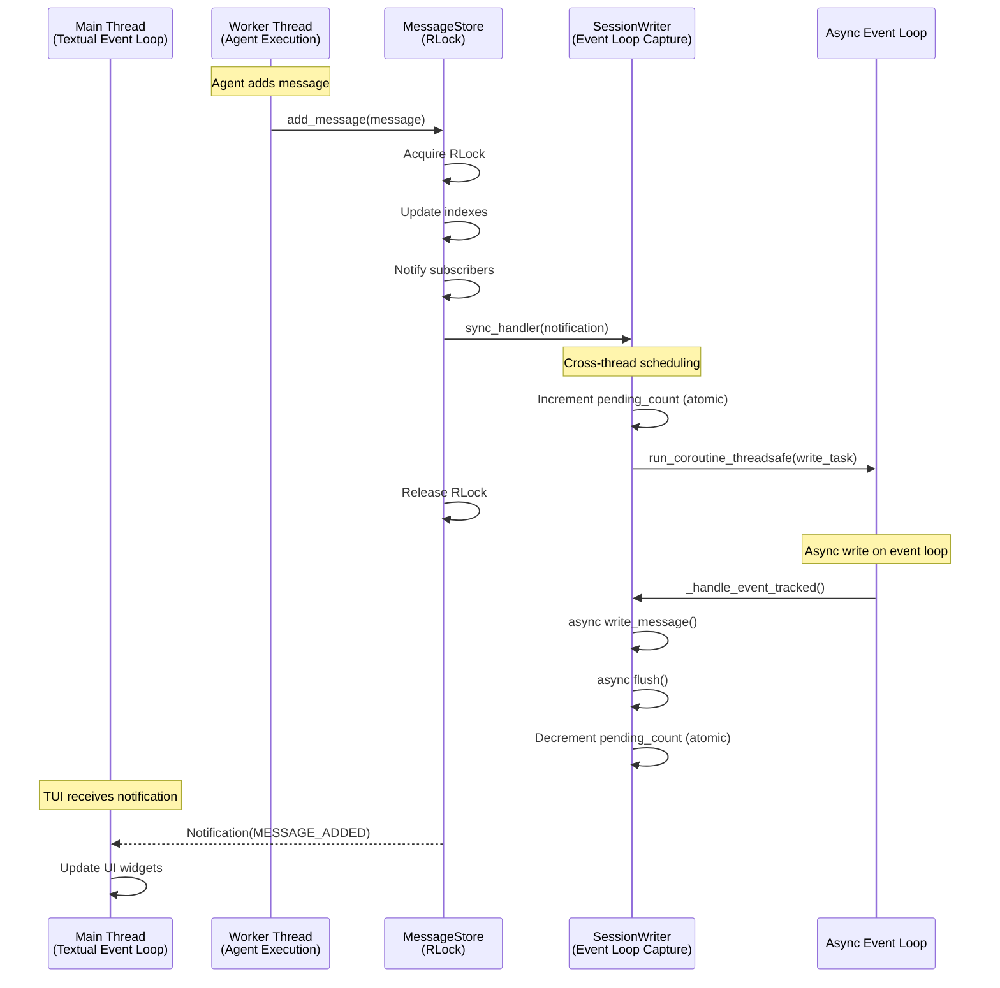

**Thread Safety Zones:**

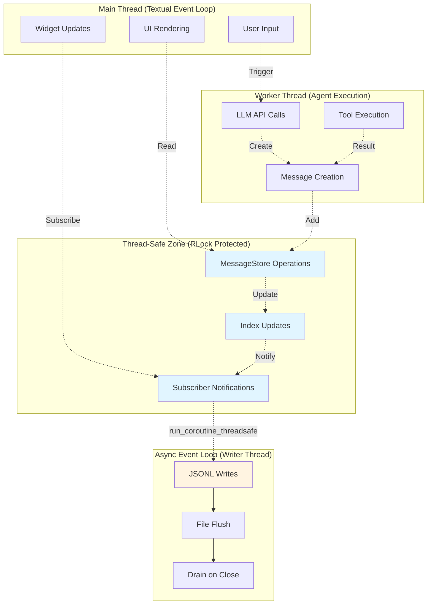

---

### Focus Management

#### Approval Widget Focus

**Challenge:** Ensure approval widget receives keyboard input

**Solution:** Multi-layered focus strategy

```python
def on_mount(self) -> None:
    # 1. Call after refresh (preferred)
    self.call_after_refresh(self._ensure_focus)
    
def _ensure_focus(self) -> None:
    if not self.has_focus:
        self.focus()
```

**Why not timer?** Redundant and may cause race conditions

---

### Auto-Scroll Behavior

**Goal:** Keep new content visible without disrupting user scrolling

**Strategy:**
```python
# Check if user was at bottom BEFORE appending
was_at_bottom = (
    self._conversation.is_vertical_scroll_end
    if self._conversation else True
)

# ... append content (moves bottom) ...

# Only auto-scroll if user was at bottom
if was_at_bottom:
    self._conversation.scroll_end(animate=False)
```

**Alternative (more robust):**
```python
# Use Textual's scroll_visible() instead
content_widget.scroll_visible(animate=False)
```

---

### Error Handling

#### User-Friendly Error Classification

```python
def _classify_error(e: Exception) -> tuple[str, str]:
    """
    Classify an exception into a user-friendly message.
    
    Returns:
        Tuple of (user_friendly_message, error_category)
    """
    error_str = str(e).lower()
    
    # Rate limiting
    if "rate" in error_str and "limit" in error_str:
        return ("Rate limited. Please wait a moment.", "rate_limit")
    
    # Authentication
    if "auth" in error_str or "api key" in error_str:
        return ("Authentication failed. Check your API key.", "auth")
    
    # Network
    if "connection" in error_str or "timeout" in error_str:
        return ("Network error. Check your connection.", "network")
    
    # Default
    return (f"Error: {str(e)}", "unknown")
```

---

#### Incomplete Tool Call Recovery

**Problem:** Stream ends while tool call is incomplete (partial JSON)

**Current Handling:**
```python
# In StreamProcessor._flush_all()
for idx, acc in self._tool_calls.items():
    if not acc.is_complete():
        yield ErrorEvent(
            error_type="incomplete_tool_call",
            message=f"Tool call '{acc.name}' incomplete",
            recoverable=False,
        )
```

**Recommended Enhancement:**
```python
# In app._handle_error()
elif error_type == "incomplete_tool_call":
    # Show error, don't retry (API bug)
    status_bar.show_error(f"Tool call parsing failed: {message}")
    # Add to message for visibility
    if self._current_message:
        await self._current_message.add_text(f"\n\n[!] {message}")
```

---

#### Error Handling Decision Tree

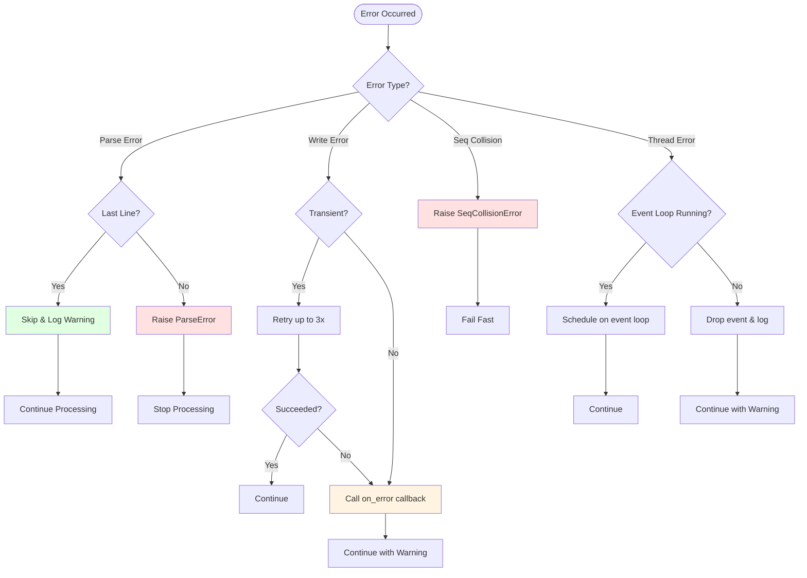

---

### Timer Cleanup

**Problem:** Timers may continue running if app crashes

**Solution:** Cleanup in `on_unmount()`

```python
def on_unmount(self) -> None:
    """Clean up timers"""
    self._stop_elapsed_timer()
    self._stop_countdown()
    self._stop_spinner_timer()
```

**Enhanced (with try/finally):**
```python
def _start_elapsed_timer(self) -> None:
    if self._elapsed_timer:
        self._elapsed_timer.stop()
    try:
        self._elapsed_timer = self.set_interval(1.0, self._update_elapsed)
    except Exception as e:
        self.log.error(f"Failed to start elapsed timer: {e}")
```

---

## Known Issues and Technical Debt

### P0 - CRITICAL (Production Breaking)

#### ✅ Issue 6.0: add_text() Does Not Await mount() - FIXED

**Status:** ✅ RESOLVED  
**Location:** `src/ui/widgets/message.py`, `add_text()` method  
**Fix:** Made `add_text()` async and await `mount()` before `update()`

---

### P1 - HIGH (Should fix before production)

#### Issue 6.2: Missing Error Recovery for Incomplete Tool Calls

**Severity:** HIGH  
**Location:** `src/ui/stream_processor.py`, `_flush_all()`  
**Status:** 🚧 OPEN

**Description:**
If stream ends while tool call is incomplete (partial JSON), error event is emitted but not propagated to UI error handler.

**Recommendation:** Add case for incomplete tool calls in error handler (see Error Handling section above)

---

#### Issue 6.3: Race Condition in Auto-Scroll During Flush

**Severity:** HIGH  
**Location:** `src/ui/app.py`, `_flush_segment()` and `_flush_deltas()`  
**Status:** 🚧 OPEN

**Description:**
Current code checks `is_vertical_scroll_end` BEFORE appending content. Fragile if parent layout changes during append.

**Recommendation:** Test with large messages (100+ KB). If scrolling jumps, switch to `scroll_visible()` approach.

---

#### Issue 6.4: StatusBar Timers Not Always Cleaned Up

**Severity:** HIGH  
**Location:** `src/ui/widgets/status_bar.py`  
**Status:** 🚧 OPEN

**Description:**
If app is interrupted during streaming, timers may continue running.

**Recommendation:** Add try/finally in all timer methods (see Timer Cleanup section above)

---

#### Issue 6.5: ToolApprovalOptions Keyboard Focus Not Guaranteed

**Severity:** HIGH  
**Location:** `src/ui/widgets/tool_card.py`, `ToolApprovalOptions.on_mount()`  
**Status:** 🚧 OPEN

**Description:**
Focus is set with both `call_after_refresh()` AND a timer, which is redundant and may cause race conditions.

**Recommendation:** Use `call_after_refresh()` only (remove timer)

---

#### Issue 6.6: Large Message Performance Degradation

**Severity:** HIGH  
**Location:** `src/ui/widgets/message.py`, streaming text mode  
**Status:** 🚧 OPEN

**Description:**
For very large responses (100KB+), Markdown rendering can become slow (100-500ms freeze).

**Recommendation:**
1. Consider lazy rendering for code blocks
2. Keep thinking blocks collapsed by default
3. Profile with large responses - if > 200ms render time, add progress indicator

---

### P2 - MEDIUM (Nice to have, can defer)

#### Issue 6.7: No Input Validation on Feedback Text

**Severity:** MEDIUM  
**Status:** 🚧 OPEN

**Description:**
User can type any character including control chars, ANSI sequences, etc. in feedback.

**Recommendation:**
```python
if event.character in '\n\r\t':  # Strip control chars
    event.prevent_default()
    return
if event.is_printable:
    self.feedback_text += event.character
```

---

#### Issue 6.8: No Maximum Feedback Length

**Severity:** MEDIUM  
**Status:** 🚧 OPEN

**Description:**
User can type unlimited feedback text, which could overflow display or cause performance issues.

**Recommendation:** Add length limit (e.g., 500 characters)

---

#### Issue 6.9: Auto-Approve List Not Persisted

**Severity:** MEDIUM  
**Status:** 🚧 OPEN (Deferred by design)

**Description:**
Auto-approve rules are stored in memory only. Lost on restart.

**Recommendation:** Defer for now. Security-first approach (reapprove each session) is fine.

---

#### Issue 6.10: No User Input History / Line Editing

**Severity:** MEDIUM  
**Status:** 🚧 OPEN (Deferred to Phase 2)

**Description:**
`ChatInput` is a basic Textual Input widget. No Up/Down arrow history navigation, Ctrl+R reverse search, or Emacs/Vi key bindings.

**Recommendation:** Defer for Phase 2 TUI Polish. Current input is functional for MVP.

---

#### Issue 6.11: Code Block Copy-to-Clipboard Not Implemented

**Severity:** MEDIUM  
**Status:** 🚧 OPEN (Deferred to Phase 2)

**Description:**
Code blocks are displayed but can't be easily copied. No "Copy code" button.

**Recommendation:** Add copy button or keybinding with pyperclip

---

#### Issue 6.12: No Visual Distinction Between Tool Approval States

**Severity:** MEDIUM  
**Status:** 🚧 OPEN (Deferred to Phase 2)

**Description:**
ToolCard visually looks similar whether AWAITING_APPROVAL, APPROVED, or REJECTED.

**Recommendation:**
- Add indicator to AWAITING_APPROVAL (red box border)
- Make approval widget more prominent (flash/animate until focused)

---

#### Issue 6.13: Tool Result Preview Truncation Could Lose Critical Info

**Severity:** MEDIUM  
**Status:** 🚧 OPEN (Deferred to Phase 2)

**Description:**
Result preview is truncated to 60 chars. For critical errors or JSON results, truncation could hide important details.

**Recommendation:** Show full result in collapsible/expandable section or hover tooltip

---

### P3 - LOW (Polish, can defer indefinitely)

#### Issue 6.14: No Dark/Light Theme Toggle

**Severity:** LOW  
**Status:** 🚧 OPEN (Deferred)

**Recommendation:** Defer. Textual theme switching is possible but not critical for MVP.

---

#### Issue 6.15: No Keyboard Shortcut Reference Widget

**Severity:** LOW  
**Status:** 🚧 OPEN (Deferred)

**Recommendation:** Add `/help` command that shows keyboard shortcuts cheatsheet

---


## Implementation Status

### Phase Status Overview

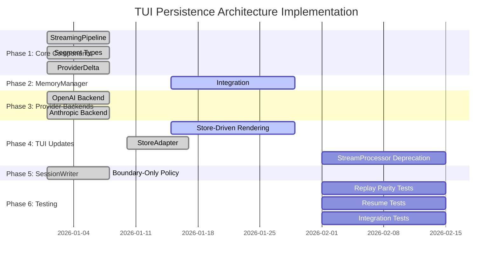

---

### Component Implementation Matrix

| Component | Planned | Implemented | Tested | Production Ready |
|-----------|---------|-------------|--------|------------------|
| **StreamingPipeline** | ✅ | ✅ | 🚧 | 🚧 |
| **MessageStore** | ✅ | ✅ | ✅ | ✅ |
| **SessionWriter** | ✅ | ✅ | ✅ | ✅ |
| **StoreAdapter** | ✅ | ✅ | 🚧 | 🚧 |
| **ProviderDelta** | ✅ | ✅ | ✅ | ✅ |
| **Segment Types** | ✅ | ✅ | ✅ | ✅ |
| **MemoryManager Integration** | ✅ | 🚧 | ❌ | ❌ |
| **TUI Store-Driven Rendering** | ✅ | 🚧 | 🚧 | ❌ |
| **StreamProcessor Deprecation** | ✅ | ❌ | ❌ | ❌ |
| **Replay Parity** | ✅ | 🚧 | ❌ | ❌ |
| **Session Resume** | ✅ | ✅ | 🚧 | 🚧 |

**Legend:**
- ✅ Complete
- 🚧 In Progress / Partial
- ❌ Not Started

---

### Implementation Gaps

#### Gap 1: Agent Integration with StreamingPipeline

**Status:** 🚧 Partial

**Current State:**
The agent currently:
- Calls `llm.generate_with_tools_stream()` directly (line 623)
- Accumulates `response_content` as string (line 641)
- Persists to `working_memory.add_message()` after stream completes (line 1983)
- Does NOT use StreamingPipeline for parsing

**What's Missing:**
- Agent should emit ProviderDelta objects (not raw chunks)
- StreamingPipeline should parse structure (code fences, tool calls)
- MemoryManager should own StreamingPipeline
- Store should receive parsed Message objects with segments

**Target Architecture:**
```python
# Target: Agent emits ProviderDelta
class CodingAgent:
    def _execute_with_tools(self, context, stream=True):
        for chunk, tc in self.llm.generate_with_tools_stream(...):
            # Convert chunk to ProviderDelta
            delta = ProviderDelta(
                stream_id=chunk.stream_id,
                text_delta=chunk.content,
                tool_call_delta=tc,
                finish_reason=chunk.finish_reason if chunk.done else None
            )
            
            # Send to MemoryManager for parsing
            message = self.memory.process_provider_delta(delta)
            
            # Message is finalized when complete
            if message:
                # Store already updated via MemoryManager
                pass

# Target: MemoryManager owns StreamingPipeline
class MemoryManager:
    def __init__(self):
        self._pipeline: Optional[StreamingPipeline] = None
        
    def start_assistant_stream(self) -> None:
        """Initialize streaming pipeline for new assistant message."""
        self._pipeline = StreamingPipeline(
            session_id=self._session_id,
            parent_uuid=self._last_user_message_uuid
        )
    
    def process_provider_delta(self, delta: ProviderDelta) -> Optional[Message]:
        """
        Process delta through canonical pipeline.
        Returns finalized Message when complete.
        Updates store on streaming (for live UI) and finalization.
        """
        message = self._pipeline.process_delta(delta)

        # Update store with current state (for live UI)
        # Note: add_message() handles collapse by stream_id automatically
        # (subsequent calls with same stream_id update the existing message)
        current = self._pipeline.get_current_state()
        if current:
            self._store.add_message(current)

        # Finalize on completion
        if message:
            self._store.finalize_message(message.meta.stream_id)
            self._pipeline.reset()

        return message
```

**Migration Path:**
1. Update LLM backends to emit ProviderDelta (already done ✅)
2. Add `process_provider_delta()` to MemoryManager
3. Update Agent to call `memory.process_provider_delta()` instead of accumulating strings
4. Remove direct `working_memory.add_message()` calls (replaced by Store)
5. Verify TUI renders from Store (not from Agent chunks)

---

#### Gap 2: TUI Store-Driven Rendering

**Status:** 🚧 Partial (feature flag enabled)

**What's Missing:**
- Full migration from StreamProcessor to StoreAdapter
- Some widgets still render from UIEvents directly
- Need to verify all rendering paths use MessageStore

**Current State:**
```python
# Feature flag in app.py
TUI_RENDER_FROM_STORE = os.getenv("TUI_RENDER_FROM_STORE", "true").lower() in ("1", "true", "yes")
```

**Target State:**
- Remove feature flag
- All rendering from `meta.segments`
- StreamProcessor deprecated

---

#### Gap 3: StreamProcessor Deprecation

**Status:** ❌ Not Started

**What's Missing:**
- StreamProcessor still in use for UIEvent generation
- Need to migrate all parsing to StreamingPipeline
- Need to remove StreamProcessor completely

**Migration Path:**
1. Ensure all providers emit ProviderDelta
2. Ensure StreamingPipeline handles all structural decisions
3. Ensure StoreAdapter bridges to MessageStore
4. Ensure TUI renders from MessageStore
5. Remove StreamProcessor
6. Update tests

---

#### Gap 4: Replay Parity Tests

**Status:** ❌ Not Started

**What's Missing:**
- Automated tests for replay parity
- Comparison of live vs replayed final state
- Validation of segment structure

**Test Plan:**
```python
def test_replay_parity():
    # 1. Run live session, persist to JSONL
    session_id = run_live_session(user_input="Hello")
    
    # 2. Load from JSONL
    messages = load_session(session_id)
    
    # 3. Compare final state
    assert live_messages == replayed_messages
    assert live_segments == replayed_segments
    assert live_tool_calls == replayed_tool_calls
```

---

### Migration Checklist

#### Phase 1: Core Components ✅ COMPLETE

- [x] StreamingPipeline class exists with `process_delta()` method
- [x] All segment types defined (TextSegment, CodeBlockSegment, ToolCallRefSegment, ThinkingSegment)
- [x] ProviderDelta dataclass defined
- [x] Unit tests pass for pipeline (code fence detection, tool call assembly)

---

#### Phase 2: Update MemoryManager 🚧 IN PROGRESS

- [ ] `process_provider_delta()` method added
- [ ] StreamingPipeline integrated internally
- [ ] All store writes go through MemoryManager only
- [ ] Unit tests pass for message flow

---

#### Phase 3: Update Provider Backends ✅ COMPLETE

- [x] Providers emit `ProviderDelta` with `stream_id`
- [x] Providers do NOT make structural decisions
- [x] Integration tests pass with real LLM calls

---

#### Phase 4: Update TUI 🚧 IN PROGRESS

- [x] StoreAdapter created and functional
- [ ] TUI renders from `meta.segments` only (feature flag enabled)
- [ ] All markdown parsing removed from TUI
- [ ] Tool cards rendered via `tool_call_id` lookup
- [ ] StoreAdapter no longer builds segments (moved to StreamingPipeline)
- [ ] StreamProcessor deprecated

---

#### Phase 5: Update SessionWriter ✅ COMPLETE

- [x] `WritePolicy` enum added
- [x] Default is `BOUNDARY_ONLY`
- [x] Only `MESSAGE_FINALIZED` events persisted

---

#### Phase 6: Testing and Migration ❌ NOT STARTED

- [ ] Replay parity tests pass (final state comparison)
- [ ] Resume tests pass (continue from loaded session)
- [ ] Backward compatibility tests pass (legacy JSONL without segments)
- [ ] Integration tests with real agent flow

---

### File Changes Summary

| File | Change | Status | Description |
|------|--------|--------|-------------|
| `src/core/streaming/__init__.py` | NEW | ✅ | Package init |
| `src/core/streaming/pipeline.py` | NEW | ✅ | StreamingPipeline (canonical parser) |
| `src/core/streaming/state.py` | NEW | ✅ | StreamingState dataclass |
| `src/session/models/message.py` | MODIFY | ✅ | Add segment types, convenience `.segments` property |
| `src/llm/base.py` | MODIFY | ✅ | Add ProviderDelta, ToolCallDelta |
| `src/llm/openai_backend.py` | MODIFY | ✅ | Emit ProviderDelta |
| `src/llm/anthropic_backend.py` | MODIFY | ✅ | Emit ProviderDelta |
| `src/memory/memory_manager.py` | MODIFY | 🚧 | Add `process_provider_delta()`, integrate pipeline |
| `src/session/store/memory_store.py` | MODIFY | ✅ | Add streaming collapse via `add_message()` with stream_id, explicit API |
| `src/session/persistence/writer.py` | MODIFY | ✅ | Add WritePolicy enum |
| `src/ui/app.py` | MODIFY | 🚧 | Render from segments only, remove parsing |
| `src/ui/store_adapter.py` | NEW | ✅ | READ-ONLY UIEvent state tracker (MemoryManager writes to store) |
| `src/ui/stream_processor.py` | DELETE | ❌ | Replaced by StreamingPipeline |

---

### Next Steps

#### Immediate (Before Production)

1. **Complete MemoryManager Integration**
   - Implement `process_provider_delta()` method
   - Integrate StreamingPipeline ownership
   - Remove duplicate store writes

2. **Complete TUI Store-Driven Rendering**
   - Remove feature flag
   - Verify all rendering paths use MessageStore
   - Migrate remaining UIEvent-based rendering

3. **Fix P1 Issues**
   - Issue 6.2: Incomplete tool call error handling
   - Issue 6.3: Auto-scroll race condition
   - Issue 6.4: StatusBar timer cleanup
   - Issue 6.5: ToolApprovalOptions focus

4. **Add Replay Parity Tests**
   - Automated tests for live vs replayed comparison
   - Segment structure validation
   - Tool call correlation validation

---

#### Phase 2 (TUI Polish)

1. **Issue 6.10** - Add input history (Up/Down arrows)
2. **Issue 6.11** - Add copy-to-clipboard for code blocks
3. **Issue 6.14** - Theme toggle (dark/light)
4. **Issue 6.12** - Visual prominence for pending approvals

---

#### Performance Testing

1. Test with large responses (100KB+)
2. Profile Markdown rendering time
3. Monitor memory usage during long sessions
4. Load test with rapid tool approvals

---

#### Documentation

1. ✅ Add TUI architecture diagram to docs/ (this document)
2. ✅ Document streaming modes (segmented vs full)
3. [ ] Create troubleshooting guide for common issues
4. [ ] Add keyboard shortcut reference card

---

## Appendix A: File Manifest

```
src/ui/
├── app.py                      # Main Textual app (1000+ LOC)
├── events.py                   # Typed event contract (233 LOC)
├── protocol.py                 # Bidirectional coordination (248 LOC)
├── messages.py                 # Textual message types (78 LOC)
├── stream_processor.py         # State machine (700 LOC) [TO BE DEPRECATED]
├── store_adapter.py            # READ-ONLY UIEvent state tracker (NEW)
├── agent_adapter.py            # Bridge to existing agent (378 LOC)
├── chat_interface.py           # Legacy prompt_toolkit TUI (651 LOC)
├── run_tui.py                  # Entry point (126 LOC)
├── formatters.py               # Text formatting utilities
├── styles.tcss                 # Textual CSS (225 LOC)
└── widgets/
    ├── message.py              # Message container (514 LOC)
    ├── code_block.py           # Syntax-highlighted code (168 LOC)
    ├── tool_card.py            # Tool card + approval UI (579 LOC)
    ├── thinking.py             # Collapsible thinking (238 LOC)
    ├── status_bar.py           # Bottom status bar (335 LOC)
    └── __init__.py

src/core/streaming/
├── __init__.py                 # Package init
├── pipeline.py                 # StreamingPipeline (canonical parser)
└── state.py                    # StreamingState dataclass

src/session/
├── manager/
│   └── session_manager.py      # SessionManager class
├── store/
│   └── memory_store.py         # MessageStore (in-memory projection)
├── persistence/
│   ├── parser.py               # JSONL parser (load_session)
│   └── writer.py               # JSONL writer (SessionWriter)
└── models/
    ├── base.py                 # SessionContext, generate_uuid
    └── message.py              # Message models, segment types

tests/ui/
├── test_stream_processor.py    # Comprehensive stream tests
└── __init__.py
```

**Total:** ~6000 LOC of TUI + Persistence code

---

## Appendix B: Glossary

| Term | Definition |
|------|-----------|
| **Streaming** | Real-time delivery of LLM response chunks to UI |
| **Segmented** | Streaming mode that buffers text until boundaries (default) |
| **Delta** | Incremental chunk of content (text, code, etc.) |
| **ProviderDelta** | Normalized delta from LLM provider (no structural decisions) |
| **UIEvent** | Typed event contract (StreamStart, TextDelta, ToolCallStart, etc.) |
| **UIProtocol** | Async coordination layer between agent and UI |
| **Worker** | Textual background worker for non-blocking tasks |
| **MessageWidget** | Container for all blocks in a single message |
| **Block** | Content element (Markdown, CodeBlock, ToolCard, ThinkingBlock) |
| **ToolCard** | Visual representation of tool call status |
| **Approval** | User permission to execute a tool |
| **Auto-Approve** | Session-scoped rule to skip approval for specific tools |
| **Fence** | Code block delimiters (``` ... ```) |
| **Thinking** | Extended reasoning/thinking block (Claude models) |
| **Debounce** | Delay rendering until natural boundary (prevents flickering) |
| **Coalesce** | Combine multiple small updates into one larger update |
| **Projection** | In-memory view of data (MessageStore) |
| **Ledger** | Append-only persistent log (JSONL file) |
| **Boundary** | Event that triggers segment flush (tool call, code block, stream end) |
| **Replay Parity** | Final state of replayed session matches live session |
| **Store-Driven Rendering** | TUI renders from MessageStore, not directly from events |

---

## Appendix C: Key Design Decisions & Rationale

### Decision 1: StreamingPipeline in Agent/Core (Not TUI)

**Choice:** StreamingPipeline owned by Agent/Core layer

**Rationale:**
- Structural decisions (code fences, tool calls) are domain logic, not UI concern
- Enables testing without UI
- Allows multiple UI frontends (TUI, web, CLI) to share same parser
- TUI becomes pure renderer (simpler, more maintainable)

**Alternative Considered:** StreamProcessor in UI layer - REJECTED (couples parsing to UI)

---

### Decision 2: Segments in meta.segments (Not Top-Level)

**Choice:** Store segments in `meta.segments`, not top-level field

**Rationale:**
- Keeps OpenAI-compatible fields clean (role, content, tool_calls)
- Segments are UI-specific, not part of LLM context
- Easy to strip before sending to LLM
- Backward compatible with existing code

**Alternative Considered:** Top-level `segments` field - REJECTED (breaks OpenAI compatibility)

---

### Decision 3: Tool Calls Referenced by ID (Not Index)

**Choice:** ToolCallRefSegment uses `tool_call_id`, not `tool_call_index`

**Rationale:**
- Index is fragile if tool_calls are reordered, filtered, or partially present
- ID is stable across provider adapters
- Matches OpenAI tool-call model
- Enables O(1) lookup with map

**Alternative Considered:** Index-based reference - REJECTED (fragile)

---

### Decision 4: Boundary-Only Persistence (Not Every Delta)

**Choice:** Only persist MESSAGE_FINALIZED events, not MESSAGE_UPDATED

**Rationale:**
- Compact JSONL files (10x smaller)
- Faster replay (fewer lines to parse)
- Sufficient for resume (final state is what matters)
- Streaming animation not needed for replay

**Alternative Considered:** Persist every delta - REJECTED (bloated files, slow replay)

---

### Decision 5: Worker Pattern for Streaming

**Choice:** Use Textual's `run_worker()` instead of direct task spawning

**Rationale:**
- Textual Workers provide exclusive, ordered execution
- Built-in cancellation support
- Prevents concurrent stream race conditions
- Cleaner than manual asyncio task management

**Alternative Considered:** Direct asyncio task - REJECTED (harder to coordinate with Textual message loop)

---

### Decision 6: Segmented Streaming as Default

**Choice:** Accumulate text until boundaries, render once as Markdown

**Rationale:**
- Better UX (stable, readable chunks)
- Faster rendering (O(1) Markdown parse per response, not per event)
- Prevents flickering from partial word streams

**Alternative Considered:** Full streaming (render every delta) - works but slower for large responses

---

### Decision 7: Explicit Mount of Approval Widget

**Choice:** Mount ToolApprovalOptions in `on_mount()`, not `compose()`

**Rationale:**
- Static widgets don't reliably render children from `compose()`
- Explicit mount in `on_mount()` guarantees widget is in DOM before receiving focus
- Fixed the keyboard input issue where approval widget was invisible

**Alternative Considered:** Use Dynamic container instead of Static - REJECTED (added complexity)

---

### Decision 8: No Timeout on Approvals

**Choice:** Wait indefinitely for user approval (no timeout)

**Rationale:**
- User may be multitasking, reading code, considering implications
- Timeout could interrupt important decision-making
- Better UX than "Timeout, try again"

**Alternative Considered:** 30s timeout - REJECTED (too aggressive)

---

### Decision 9: Text Markers Instead of Emojis

**Choice:** Use `[o]`, `[+]`, `[!]` instead of emojis

**Rationale:**
- Windows console uses cp1252 encoding (not UTF-8)
- Emojis cause rendering crashes/corruption on Windows
- Text markers are clear and reliable across all terminals

**Impact:** Zero emoji in Python code, logging, subprocess output

---

## Appendix D: References

### Source Documents

- `docs/UNIFIED_PERSISTENCE_ARCHITECTURE_FINAL.md` - Target persistence architecture
- `docs/TUI_ARCHITECTURE.md` - TUI design and implementation details

### Related Documentation

- `docs/SESSION_PERSISTENCE.md` - Session persistence overview
- `docs/TUI_PERFORMANCE_FIXES.md` - Performance optimization history
- `docs/TUI_APPROVAL_ISSUE.md` - Approval widget focus debugging

### Code References

- `src/ui/app.py` - Main Textual application
- `src/core/streaming/pipeline.py` - Canonical parser
- `src/session/store/memory_store.py` - In-memory projection
- `src/session/persistence/writer.py` - JSONL writer
- `src/ui/store_adapter.py` - READ-ONLY UIEvent state tracker (MemoryManager writes to store)

---

**End of Documentation**

---

**Document Version:** 1.2
**Last Updated:** 2026-01-25
**Authors:** AI Coding Agent Team
**Status:** Living Document (will be updated as implementation progresses)

**Changelog:**
- v1.2 (2026-01-25): Merged enhanced diagrams from PERSISTENCE_ARCHITECTURE_DEEP_DIVE.md
  - Added MessageStore index structure diagrams
  - Added index lookup examples with O(1) complexity
  - Added performance characteristics table
  - Added thread safety model sequence diagram
  - Added error handling decision tree
  - Added missing StoreEvents (SNAPSHOT_ADDED, STORE_CLEARED)

