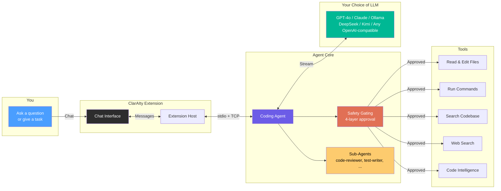

# ClarAIty VS Code Extension — Welcome Page Content

> **Purpose**: Content and diagrams for the extension's onboarding/welcome page.
> Designed to make the agent appealing to first-time users.

---

## Welcome Page Layout

```
+------------------------------------------------------------------+
|  [ClarAIty Logo]                                                  |
|                                                                    |
|  ClarAIty — AI Coding Agent                                       |
|  Your intelligent coding partner with built-in safety,             |
|  multi-agent orchestration, and any-LLM flexibility.               |
|                                                                    |
|  [Get Started]  [Configure LLM]  [View Documentation]             |
+------------------------------------------------------------------+
|                                                                    |
|  === How It Works ===                                              |
|  [Architecture Diagram]                                            |
|                                                                    |
|  === Key Features ===                                              |
|  [Feature Cards Grid]                                              |
|                                                                    |
|  === Quick Start ===                                               |
|  [Step-by-step setup]                                              |
|                                                                    |
|  === Keyboard Shortcuts ===                                        |
|  [Shortcuts table]                                                 |
+------------------------------------------------------------------+
```

---

## Section 1: Hero Banner

### Headline
**ClarAIty — Your AI Coding Agent**

### Subheadline
An intelligent coding assistant that reads your code, executes tools, delegates to specialized sub-agents, and asks before making changes — powered by any LLM you choose.

### CTA Buttons
- **Get Started** -> Opens chat view with first-message prompt
- **Configure LLM** -> Opens config panel
- **Documentation** -> Opens ARCHITECTURE_DEEP_DIVE.md

---

## Section 2: Architecture Overview Diagram



### Simplified version (for narrow sidebar)

```
  You
   |
   v
[Chat Interface] --- VS Code Sidebar
   |
   v
[Coding Agent] --- Understands your code
   |
   +---> [Safety Gating] --- Asks before changing files
   |
   +---> [25+ Tools] --- Read, write, search, run commands
   |
   +---> [Sub-Agents] --- Specialized reviewers & writers
   |
   v
[Any LLM] --- GPT-4o, Claude, Ollama, DeepSeek, ...
```

---

## Section 3: Feature Cards

### Card 1: Any LLM, Your Choice
**Icon**: `$(server)` (codicon)

Use OpenAI, Anthropic Claude, Ollama (local), DeepSeek, Kimi, or any OpenAI-compatible API. Switch models mid-session without restarting. Configure per-subagent model overrides for cost optimization.

### Card 2: Human-in-the-Loop Safety
**Icon**: `$(shield)` (codicon)

4-layer safety gating ensures the agent asks before making changes:
- **Repeat detection** — blocks identical failing operations
- **Plan mode** — read-only exploration before execution
- **Director workflow** — phased execution with checkpoints
- **Approval system** — review diffs before file writes

### Card 3: Specialized Sub-Agents
**Icon**: `$(organization)` (codicon)

Delegate tasks to purpose-built sub-agents, each with their own context window and optimized prompts:
- **code-reviewer** — finds bugs, security issues, and improvements
- **test-writer** — generates comprehensive test suites
- **doc-writer** — creates documentation from code
- **explore** — researches codebases and answers questions

### Card 4: Smart Tool Execution
**Icon**: `$(tools)` (codicon)

25+ built-in tools with parallel execution, intelligent error recovery, and configurable timeouts:
- Read, write, and edit files with diff preview
- Run commands in an integrated terminal
- Search code with grep and glob patterns
- Web search and fetch for documentation
- LSP-powered code intelligence (outlines, symbols)

### Card 5: Session Memory
**Icon**: `$(history)` (codicon)

Every conversation is persisted and resumable. The agent remembers context across turns, compacts old messages intelligently, and maintains an episodic memory of your session history.

### Card 6: VS Code Integration
**Icon**: `$(code)` (codicon)

Deep VS Code integration, not just a chat window:
- **CodeLens**: Accept/Reject/View Diff inline at the top of modified files
- **File badges**: See which files the agent modified in the explorer
- **Diff editor**: Full VS Code diff view for proposed changes
- **Turn undo**: Revert all changes from any agent turn
- **Context menu**: Right-click to explain, fix, or refactor selected code
- **Terminal echo**: See executed commands in a dedicated terminal

### Card 7: Observability Built In
**Icon**: `$(graph-line)` (codicon)

Structured JSONL logging, SQLite error tracking, session transcripts, and context pressure monitoring. Every LLM call, tool execution, and error is traced with correlation IDs.

### Card 8: Extensible by Design
**Icon**: `$(extensions)` (codicon)

- **MCP Protocol**: Connect external tools via the Model Context Protocol
- **Custom sub-agents**: Define specialized agents in `.clarity/subagents/`
- **Jira integration**: Create and manage issues directly from chat
- **Hot-swap config**: Change LLM settings without restarting

---

## Section 4: Quick Start

### Step 1: Configure Your LLM
Click the gear icon in the sidebar toolbar to open the configuration panel. Enter your API key and select a model.

**Supported providers**: OpenAI, Anthropic, Ollama (local), Azure OpenAI, Groq, Together.ai, DeepSeek, Kimi, and any OpenAI-compatible endpoint.

### Step 2: Start Chatting
Type a message in the chat input. The agent will analyze your workspace, read relevant files, and respond with context-aware assistance.

**Try these first messages**:
- "Explain the architecture of this project"
- "Find and fix bugs in src/auth.ts"
- "Write tests for the User model"
- "Refactor the database layer to use connection pooling"

### Step 3: Review & Approve
When the agent proposes file changes, you'll see a diff preview. Click **Accept** to apply or **Reject** to decline. Use the auto-approve toggle for trusted operations.

### Step 4: Use Sub-Agents
For complex tasks, the agent automatically delegates to specialized sub-agents. You can also request delegation explicitly: "Use the code-reviewer to audit this file."

---

## Section 5: Keyboard Shortcuts

| Shortcut | Action |
|----------|--------|
| `Ctrl+Shift+L` (`Cmd+Shift+L`) | New chat / focus chat view |
| `Ctrl+Shift+.` (`Cmd+Shift+.`) | Interrupt agent |
| `Ctrl+Shift+H` (`Cmd+Shift+H`) | Session history |
| `Ctrl+'` (`Cmd+'`) | Add selection to chat |
| `Enter` | Send message |
| `Shift+Enter` | New line in message |
| `@` | File mention autocomplete |

---

## Section 6: Comparison Table (optional, for marketing page)

| Feature | ClarAIty | Other Extensions |
|---------|----------|-----------------|
| Any LLM provider | Yes | Usually 1-2 |
| Human-in-the-loop safety | 4-layer gating | Basic approval |
| Sub-agent delegation | 7 specialized agents | None or basic |
| Error recovery | SHA256 repeat detection + budgets | Simple retry |
| Session persistence | Full JSONL + resume | Varies |
| Diff preview | VS Code native diff | Inline text |
| Turn-level undo | Yes | No |
| Hot-swap LLM config | Yes | Restart required |
| Plan mode | Yes | No |
| Director workflow | Yes | No |
| Jira integration | Built-in | Plugin/MCP |
| Observability | Structured logging + SQLite | Console logs |

---

## Section 7: Architecture at a Glance (technical users)

```
User Input
  |
  v
[React Webview] -- 22 components, 1215-line state machine
  |
  v (postMessage)
[Extension Host] -- CodeLens, file badges, diff editor, undo manager
  |
  v (stdin + TCP)
[Python Agent] -- 3078-line async streaming orchestrator
  |
  +---> [4-Layer Gating] -- repeat / plan / director / approval
  |
  +---> [25+ Tools] -- parallel execution, configurable timeouts
  |       |
  |       +---> File operations (read, write, edit, append)
  |       +---> Search (grep, glob, web)
  |       +---> Code intelligence (LSP outline, symbols)
  |       +---> Commands (terminal execution)
  |       +---> Knowledge base (project manifest)
  |
  +---> [Sub-Agents] -- subprocess isolation, own context window
  |       |
  |       +---> code-reviewer, test-writer, doc-writer
  |       +---> code-writer, explore, planner, general-purpose
  |
  +---> [LLM Backend] -- OpenAI / Anthropic / Ollama / any compatible
  |       |
  |       +---> Streaming with ProviderDelta contract
  |       +---> Retry with exponential backoff + jitter
  |       +---> Prompt cache tracking
  |
  +---> [Memory] -- 3-layer context management
  |       |
  |       +---> Working memory (recent, compactable)
  |       +---> Episodic memory (compressed history)
  |       +---> Observation store (large output masking)
  |
  +---> [Persistence] -- JSONL ledger + MessageStore projection
          |
          +---> Session resume from any point
          +---> Async write with drain-on-close
          +---> Structured logging + error taxonomy
```

---

## Implementation Notes

### Where to render this
The welcome page should be shown:
1. On first extension activation (no previous session)
2. When user clicks "ClarAIty" in the status bar with no active chat
3. Accessible via command palette: "ClarAIty: Show Welcome"

### Technical implementation
- Render as a VS Code WebviewPanel (not the sidebar webview)
- Use the same React build system as the sidebar
- Create `WelcomePage.tsx` component
- Store "has seen welcome" flag in `globalState`

### Mermaid rendering
For the architecture diagram in the webview:
- Option A: Pre-render Mermaid to SVG at build time (recommended)
- Option B: Include mermaid.js in webview (adds ~1MB, CSP complexity)
- Option C: Use static PNG/SVG assets (simplest, less maintainable)

Recommended: Option A — use `@mermaid-js/mermaid-cli` in build script to generate SVGs, include as static assets.
