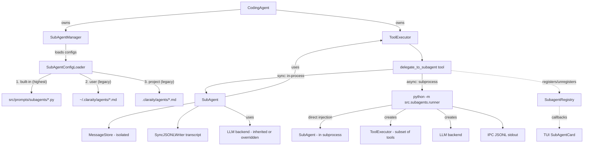
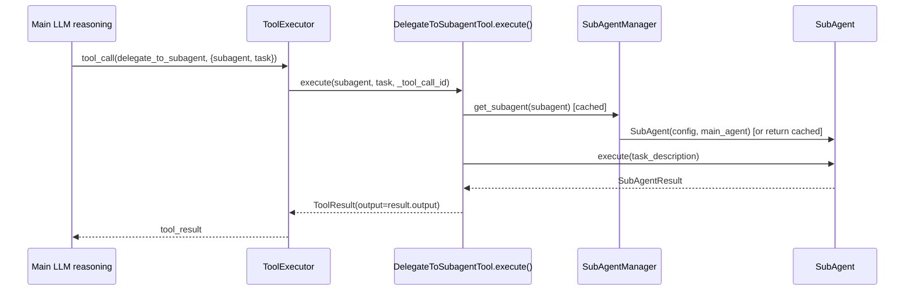
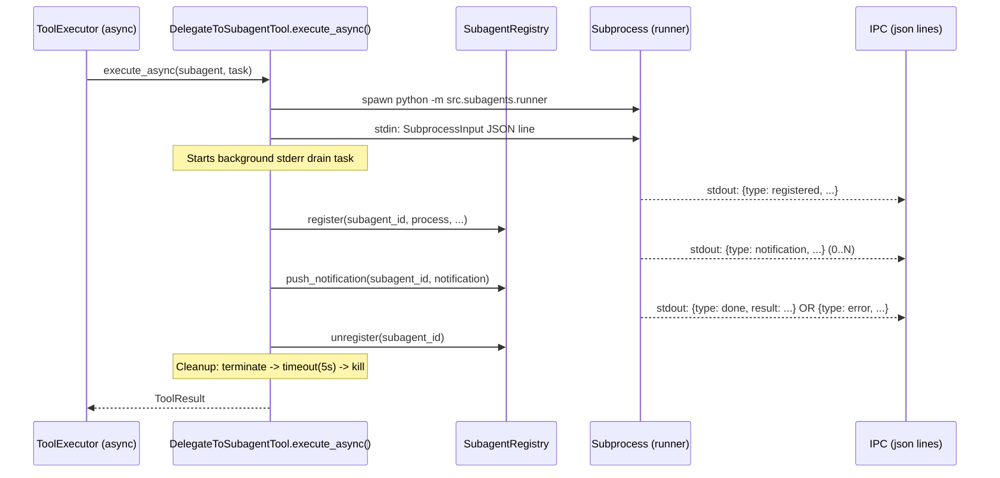

# Subagent Architecture (Delegation System)

> **Scope:** This document focuses on the subagent delegation system—primarily the `delegate_to_subagent` tool and the infrastructure that discovers, runs, and aggregates subagent work.
>
> **Audience:** Humans and LLMs. The goal is to enable debugging and enhancement of the system.

## Table of contents

- [1. High-level overview](#1-high-level-overview)
- [2. Real-world analogy](#2-real-world-analogy)
- [3. Architecture diagrams](#3-architecture-diagrams)
  - [3.1 Overall subagent architecture](#31-overall-subagent-architecture)
  - [3.2 Communication flow: main agent <-> subagent](#32-communication-flow-main-agent--subagent)
  - [3.3 Lifecycle of a subagent task](#33-lifecycle-of-a-subagent-task)
- [4. Module breakdown](#4-module-breakdown)
  - [4.1 Subagent types (code-reviewer, test-writer, doc-writer)](#41-subagent-types-code-reviewer-test-writer-doc-writer)
  - [4.2 Delegation mechanism](#42-delegation-mechanism)
  - [4.3 Context isolation](#43-context-isolation)
  - [4.4 Communication protocol](#44-communication-protocol)
  - [4.5 Result aggregation](#45-result-aggregation)
  - [4.6 Cancellation](#46-cancellation)
- [5. Why this design?](#5-why-this-design)
- [6. Troubleshooting & debugging](#6-troubleshooting--debugging)
- [7. Deep-dive pointers (files/functions)](#7-deep-dive-pointers-filesfunctions)

---

## 1. High-level overview

The main `CodingAgent` can delegate a self-contained subtask (e.g., "write tests for X", "review Y for security", "draft docs for Z") to a **subagent**.

A **subagent** is a lightweight agent instance with:

- **Isolated conversation state** (fresh message store + fresh prompt context)
- A **specialized system prompt** (loaded from built-in Python constants or legacy markdown configs)
- Access to tools via a `ToolExecutor` (either inherited from the main agent or reconstructed in a subprocess)

Delegation exists in two execution modes:

- **In-process (sync / CLI)**: The tool directly calls `SubAgentManager.get_subagent(...).execute(...)`.
- **Subprocess (async / TUI)**: The tool launches `python -m src.subagents.runner` and communicates over JSON-line IPC so the UI event loop stays responsive.

---

## 2. Real-world analogy

Think of the main agent as a **general contractor** running a renovation project:

- The **main agent** is the general contractor coordinating the job, handling the overall plan, and owning the project context.
- **Subagents** are specialized subcontractors (electrician, plumber, inspector) who:
  - get a **work order** (task description)
  - bring **their own notepad** (fresh context) so they don't clutter the contractor's notebook
  - use approved **tools** (tool allowlist) to do the work
  - return a **structured report** (a `SubAgentResult`) that the contractor can integrate

The **delegation tool** is the contractor's dispatcher: it routes a request to a specific subcontractor and returns their report.

---

## 3. Architecture diagrams

### 3.1 Overall subagent architecture



### 3.2 Communication flow: main agent <-> subagent

#### Sync (in-process / CLI)



> Note: `get_subagent()` caches instances — the same `SubAgent` is reused across delegations.

#### Async (subprocess / TUI)



### 3.3 Lifecycle of a subagent task

```text
[Main agent decides to delegate]
            |
            v
[delegate_to_subagent tool call]
            |
            v
[Resolve subagent config]
  - discover configs (if not already)
  - find config by name
            |
            v
[Instantiate subagent]
  - in-process: create/cached SubAgent instance (main_agent mode)
  - subprocess: reconstruct deps via direct injection (llm, tool_executor, working_directory)
            |
            v
[Build isolated context]
  - system prompt from config
  - task description
  - working directory context
            |
            v
[Tool loop execution]
  - subagent calls tools via ToolExecutor
  - results appended to its own MessageStore
            |
            v
[Persist transcript]
  - JSONL transcript via SyncJSONLWriter
  - store notifications mirrored to transcript
            |
            v
[Return SubAgentResult]
  - success/output/error + metadata
            |
            v
[Main agent integrates result]
  - optionally emit SubagentStop hook
```

---

## 4. Module breakdown

### 4.1 Subagent types (code-reviewer, test-writer, doc-writer)

**What "types" mean in this codebase:** subagent "types" are primarily **configuration profiles**, not distinct Python subclasses.

**Where they live (3-tier priority):**

1. **Built-in Python prompts:** `src/prompts/subagents/*.py` (highest priority, always wins)
2. **User-level:** `~/.claraity/agents/*.md` (legacy/deprecated, cannot override built-in)
3. **Project-level:** `.claraity/agents/*.md` (legacy/deprecated, can override user but not built-in)

> Note: The markdown format (YAML frontmatter + markdown body) is considered legacy. The primary configs for `code-reviewer`, `test-writer`, and `doc-writer` are Python constants in `src/prompts/subagents/`. Custom subagents can still use the markdown format in tiers 2 and 3.

**Analogy:** recipe cards. Each subagent config is a recipe that tells the cook (subagent runtime) how to behave.

**Typical responsibilities:**

- `code-reviewer`: code quality, security, architecture feedback
- `test-writer`: create or update tests; may need write tools + run tools
- `doc-writer`: write docs, READMEs; often can be read-only + write docs files

### 4.2 Delegation mechanism

Delegation can be invoked two ways:

1. **Programmatic API on the agent:** `CodingAgent.delegate_to_subagent(subagent_name, task_description, ...)`.
2. **LLM tool call:** `delegate_to_subagent` tool (implemented as `DelegateToSubagentTool`).

#### Core path (in-process)

- The tool validates `subagent` and `task` via `_validate_inputs()`.
- `SubAgentManager.get_subagent(name)` returns a cached `SubAgent` instance or constructs a new one from config.
- `SubAgent.execute(task_description=...)` runs a tool-calling loop and returns `SubAgentResult`.
- The tool returns a `ToolResult` with the subagent's output.

#### Core path (subprocess)

- The tool resolves the subagent config and LLM settings via `_resolve_llm_config()`.
- It spawns `src.subagents.runner` with `asyncio.create_subprocess_exec` (16MB StreamReader limit).
- It sends a single JSON `SubprocessInput` line and closes stdin.
- A background task drains stderr to prevent pipe deadlock.
- The subprocess emits JSON-line events (`registered`, `notification`, `done`/`error`).
- On completion or error, the process is cleaned up with terminate -> timeout(5s) -> kill escalation.

**Error containment:** Both `execute_async` (delegation.py) and `execute_tool_async` (base.py) have `except Exception` safety nets that catch unexpected errors and return them as proper `ToolResult` objects, preventing the agent loop from crashing.

**Analogy:** dispatching a courier.

- Sync mode is like calling a coworker in the same office.
- Async mode is like sending a courier to another building and exchanging status updates via radio.

#### SubAgent constructor modes

The `SubAgent` class supports two construction modes:

1. **main_agent mode** (in-process): `SubAgent(config, main_agent=agent)` — extracts LLM, tool executor, and working directory from the main agent.
2. **Direct injection mode** (subprocess): `SubAgent(config, llm=llm, tool_executor=executor, working_directory=path)` — receives dependencies directly, used by the subprocess runner.

### 4.3 Context isolation

Subagents isolate context in multiple layers:

1. **Fresh conversation messages**
   - Each `SubAgent` uses its own `MessageStore` instance (`src.session.store.memory_store.MessageStore`).
2. **Fresh prompt context**
   - `SubAgent._build_context(...)` constructs messages starting from the subagent's system prompt and the task description.
   - The subagent does *not* reuse the main agent's entire conversation history.
3. **Separate transcript persistence**
   - Each execution writes to `.claraity/sessions/subagents/<name>-<session_id>.jsonl`.

**Analogy:** separate notebooks per specialist so notes don't get mixed.

> Important: Isolation is about *conversation state* and *persistence*. Tool access can still be shared (in-process) or partially reconstructed (subprocess).

### 4.4 Communication protocol

There are two "protocols" depending on execution mode.

#### 4.4.1 In-process protocol

This is a regular Python call stack:

- `ToolExecutor` -> `DelegateToSubagentTool.execute()` -> `SubAgent.execute()` -> `ToolExecutor` (for subagent tool calls)

The "protocol" is primarily the **ToolResult/SubAgentResult objects**.

#### 4.4.2 Subprocess IPC protocol (TUI)

**Wire format:** JSON Lines over stdin/stdout.

- Parent -> child: one JSON line (a `SubprocessInput`), then stdin closed.
- Child -> parent: many JSON lines (events).

Event types (see `IPCEventType`):

- `registered`: child booted, includes `subagent_id`, `model_name`
- `notification`: serialized `StoreNotification` to support live UI updates
- `done`: serialized `SubAgentResult`
- `error`: fatal error string

**Serialization details:**

- `ToolStatus` is serialized by `.name` (e.g., `"SUCCESS"`, `"ERROR"`), not by `.value` (which is an unstable `auto()` int). Deserialization resolves by name first, then falls back to int value. See `_resolve_tool_status()` in `ipc.py`.
- `SubprocessInput.__repr__` redacts the API key to prevent leakage in tracebacks/logs.
- The runner sanitizes `sk-*` API key patterns from traceback output before emitting error events over IPC.

**Analogy:** event stream / flight tracker.

- `registered` is "flight number assigned".
- `notification` is "in-flight status updates".
- `done` is "arrived + final report".

### 4.5 Result aggregation

#### Single delegation

- The tool returns a `ToolResult` (for the main agent's tool loop) built from the `SubAgentResult`.
- `CodingAgent.delegate_to_subagent(...)` returns the raw `SubAgentResult`.

#### Multiple delegations (parallel)

- `SubAgentManager.execute_parallel(tasks)` runs `delegate(...)` calls in a `ThreadPoolExecutor`.
- Results are aggregated into a `DelegationResult`.

**Analogy:** collecting reports from multiple inspectors and summarizing whether the overall inspection passed.

### 4.6 Cancellation

Subagents support cooperative cancellation via `CancelToken`:

- **TUI path:** `SubagentRegistry.cancel(subagent_id)` dispatches to:
  - **Subprocess mode:** `asyncio.Process.terminate()` sends SIGTERM to the child process. The runner's signal handler (`SIGTERM`/`SIGBREAK` on Windows) calls `subagent.cancel()`, which sets the `CancelToken`.
  - **In-process mode:** `SubAgent.cancel()` sets the `CancelToken` directly.
- **Inside the subagent:** `CancelToken.check_cancelled()` is called at each tool loop iteration. When set, the loop exits and returns a cancelled result.
- **Process cleanup:** If the subprocess doesn't exit within 5 seconds after SIGTERM, it is killed with `process.kill()`.

---

## 5. Why this design?

### Why subagents instead of "one big agent prompt"?

- **Context hygiene:** A specialized review/test/doc task can be handled without adding long tangents to the main conversation state.
- **Specialization via prompts:** Different tasks benefit from different system prompts.

### Why config-as-markdown (legacy) + Python constants (primary)?

- **Editable by humans and LLMs:** YAML frontmatter for structure + markdown body for the system prompt.
- **Project override:** legacy `.claraity/agents` configs can add custom subagents beyond the built-ins.
- **Python constants:** Built-in prompts in `src/prompts/subagents/` are versioned with the code and cannot be accidentally overridden.

### Why two execution modes (in-process + subprocess)?

- **CLI simplicity:** in-process execution is simpler and avoids process management.
- **TUI responsiveness:** subprocess mode avoids blocking the UI event loop and enables streaming status updates.

### Why JSONL IPC?

- **Robust streaming:** one event per line is easy to parse incrementally.
- **Works across platforms and runtimes:** no need for shared memory or sockets.

### Why error containment at the tool boundary?

- Both `delegation.py` and `base.py` have `except Exception` handlers that catch unexpected errors and return `ToolResult(status=ERROR)` instead of letting exceptions propagate.
- Without this, errors like asyncio `ValueError` from oversized StreamReader lines would propagate unhandled through the agent loop, get misclassified by `_classify_tool_error()`, and never appear in logs.

---

## 6. Troubleshooting & debugging

### 6.1 "Subagent not found"

Symptoms:

- ToolResult error: `Subagent '<name>' not found. Available: ...`

Checks:

- Ensure `SubAgentManager.discover_subagents()` ran (agent init typically calls it).
- For built-in subagents: verify `src/prompts/subagents/` has the corresponding Python module.
- For custom subagents: verify configs exist in `.claraity/agents/*.md` or `~/.claraity/agents/*.md`.
- Confirm the `name:` field matches what you pass to the tool.
- Remember: built-in names cannot be overridden by markdown configs.

Relevant code:

- `SubAgentConfigLoader.discover_all()`
- `SubAgentManager.get_subagent()`

### 6.2 Tool schema mismatch (LLM can't call the tool)

This system depends on the **tool schema** matching the tool implementation signature.

If the LLM emits arguments not accepted by `DelegateToSubagentTool.execute(subagent, task, ...)`, the tool call will fail at runtime.

Where to fix:

- `src/tools/tool_schemas.py` (schema)
- `src/tools/delegation.py` (implementation)

Tip:

- Add/keep a test that compares schema required fields vs the `execute()` signature.

### 6.3 Subprocess mode hangs

Common causes:

- **stderr pipe deadlock**: if the child writes too much to stderr without draining, it can block.
  - The implementation explicitly drains stderr in a background task; verify this remains intact.
- **JSON line too large**: default asyncio line limit (64KB) can be too small.
  - The subprocess is created with `limit=16 * 1024 * 1024` to tolerate large `done` events.

Where to look:

- `DelegateToSubagentTool.execute_async()` in `src/tools/delegation.py`

### 6.4 "My subagent used unexpected tools"

Two relevant behaviors:

- In-process mode: subagent inherits the main agent's `ToolExecutor` unless tool filtering is applied inside `SubAgent`.
- Subprocess mode: the runner constructs a `ToolExecutor` from a **parameterless-tool subset**, then applies `config.tools` allowlist.

If you need strict sandboxing in-process, ensure tool filtering is enforced consistently.

> Important: In subprocess mode, `FileOperationTool._workspace_root` is explicitly set to the working directory in `runner.py`. Without this, file path validation falls back to `Path.cwd()` which is fragile.

Where to look:

- `SubAgent` tool filtering behavior (in `src/subagents/subagent.py`)
- Runner tool registration + workspace root (in `src/subagents/runner.py`)

### 6.5 Transcript / persistence debugging

- Subagent transcripts: `.claraity/sessions/subagents/*.jsonl`
- Each subagent run has a unique `session_id` included in `SubAgentResult.metadata`.

Where to look:

- `SubAgent.get_session_info()`
- `SyncJSONLWriter` usage in `SubAgent.execute()`

### 6.6 ToolStatus serialization mismatch

If a new `ToolStatus` enum member is added or enum names change, IPC deserialization may silently fall back to `PENDING`.

The IPC layer serializes `ToolStatus` by `.name` (e.g., `"SUCCESS"`) not `.value` (unstable `auto()` int). Deserialization in `_resolve_tool_status()` resolves by name first, then falls back to int.

Where to look:

- `src/subagents/ipc.py`: `serialize_notification()`, `_resolve_tool_status()`
- `src/core/events.py`: `ToolStatus` enum definition

### 6.7 Errors misclassified or missing from logs

If a tool error gets classified as the wrong type (e.g., `file_not_found` for a non-file error), check `CodingAgent._classify_tool_error()` in `agent.py`. It uses substring matching on error messages — strings containing "not found" will match `file_not_found`.

The `except Exception` handlers in `delegation.py` and `base.py` ensure errors are logged before reaching the classifier. If an error is missing from logs, one of these handlers may have been removed.

---

## 7. Deep-dive pointers (files/functions)

### Primary entry points

- **Tool:** `src/tools/delegation.py`
  - `DelegateToSubagentTool.execute(...)` (sync)
  - `DelegateToSubagentTool.execute_async(...)` (subprocess)
  - `DelegateToSubagentTool._resolve_llm_config(...)` (LLM config for subprocess)
  - `DelegateToSubagentTool._validate_inputs(...)` (input validation)
  - `DelegateToSubagentTool.set_registry(...)` (TUI wiring)
- **Agent API:** `src/core/agent.py`
  - `CodingAgent.delegate_to_subagent(...)`
  - `CodingAgent.get_available_subagents(...)`

### Subagent orchestration

- `src/subagents/manager.py`
  - `SubAgentManager.discover_subagents()`
  - `SubAgentManager.get_subagent()` (cached instance creation)
  - `SubAgentManager.delegate()`
  - `SubAgentManager.execute_parallel()`
  - `SubAgentManager._select_best_subagent()` (keyword-based auto-delegation)

### Subagent runtime

- `src/subagents/subagent.py`
  - `SubAgent.__init__(...)` (two modes: `main_agent` vs direct injection)
  - `SubAgent.execute(...)`
  - `SubAgent._build_context(...)` (fresh prompt construction)
  - `SubAgent._execute_with_tools(...)` (tool loop)
  - `SubAgent._resolve_tools(...)` (tool filtering)
  - `SubAgent.cancel()` / `CancelToken` (cooperative cancellation)
  - `SubAgent.get_session_info()` (TUI registry wiring)

### Configuration

- `src/subagents/config.py`
  - `SubAgentConfig.from_file(...)` (markdown config parsing)
  - `SubAgentLLMConfig` (per-subagent LLM overrides)
  - `SubAgentConfigLoader.discover_all()` (3-tier discovery: builtin > user > project)
  - `SubAgentConfigLoader._load_from_python_prompts()` (built-in loading)
- `src/prompts/subagents/` (built-in prompt constants)

### Subprocess execution & IPC

- `src/subagents/runner.py`
  - `main()` (subprocess entrypoint)
  - `_create_tool_executor(...)` (parameterless tool set + allowlist)
  - `_create_llm_backend(...)` (backend reconstruction)
  - `_create_subagent_config(...)` (config reconstruction)
  - Sets `FileOperationTool._workspace_root` for path security
- `src/subagents/ipc.py`
  - `SubprocessInput` (parent -> child, with `__repr__` API key redaction)
  - `IPCEventType`
  - `emit_event(...)`
  - `serialize_notification(...)` / `deserialize_notification(...)`
  - `serialize_result(...)` / `deserialize_result(...)`
  - `_resolve_tool_status(...)` (name-based enum resolution)

### TUI integration

- `src/ui/subagent_registry.py`
  - `SubagentRegistry.register(...)` (track running subagent)
  - `SubagentRegistry.unregister(...)` (cleanup on completion)
  - `SubagentRegistry.push_notification(...)` (forward IPC events to TUI)
  - `SubagentRegistry.cancel(...)` (subprocess terminate / in-process cancel)
  - Thread-safe: all callback lists managed under `self._lock`
- `src/ui/app.py`
  - `_on_subagent_registered(...)` (mount SubAgentCard)
  - `_on_subagent_notification(...)` (live updates)

### Tests that describe expected behavior

- `tests/core/test_agent_subagent_integration.py`
  - Initialization, discovery
  - Delegation success/failure
  - Hook emission (`emit_subagent_stop`)
- `tests/subagents/test_ipc.py`
  - IPC serialization roundtrips
  - SubprocessInput, notification, result serialization

---

## Appendix: Minimal mental model (for LLM debugging)

- **Subagent = config + isolated store + tool loop**
- **Manager = config discovery + caching + selection**
- **Tool = bridge between main tool loop and subagent execution**
- **TUI = subprocess + JSONL events + SubagentRegistry for live updates**
- **Two constructor modes:** `main_agent` (in-process) vs direct injection (subprocess)
- **Error containment:** exceptions caught at tool boundary, logged, returned as ToolResult
